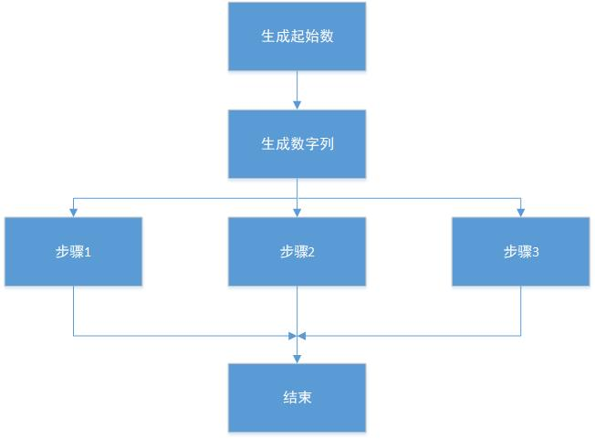
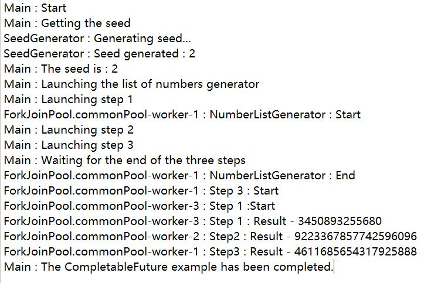

# 线程同步功能

本章将学习如下内容：

- 控制并发访问资源副本
- 等待多并发事件
- 在共同点同步任务
- 运行阶段并发任务
- 阶段并发任务中控制阶段变化
- 并发任务间交换数据
- 异步完成和连接任务

## 引言

在第二章”基础线程同步“中，学习了同步和临界区的概念。基本上，同步是指并发任务来共享资源，例如，一个对象或者对象的一个属性。临界区是访问共享资源的代码块。

如果不运用适当的机制，可能得到非正确结果、数据不一致、或者错误状态。所以，我们需要采用Java语言提供的一种同步机制来避免这些问题。

第二章”基础线程同步“中，学习了下面的基本同步机制：

- synchronized关键字
- Lock接口及其实现类：ReentrantLock、ReentrantReadWriteLock.ReadLock和ReentrantReadWriteLock.WriteLock
- StampedLock类

在本章中，学习如何使用高级机制来同步多线程。如下所示：

- **Semaphores：**是控制访问一个或多个共享资源的计数器。是并发编程中的一种基本工具，绝大多数编程语言都具备。
- **CountDownLatch：**Java语言提供，允许线程等待多重操作结束。
- **CyclicBarrier：**Java语言提供，允许在一个共同点处多线程同步。
- **Phaser：**Java语言提供，控制并发任务的阶段化执行。所有线程必须完成一个阶段，才能进入下一阶段。
- **Exchanger：**Java语言提供，用来在两个线程间进行数据点交换。
- **CompletableFuture：**CompletableFuture类提供一种机制，当其它任务将确定以一种异步方式在未来执行完成时，允许一个或多个任务等待此任务的结束。Java 8中引入此类，Java 9 中加入引入新方法。

Semaphores是通用的同步机制，用来在所有问题中保护所有临界区。前面描述的其它机制被认为处理程序中的特定要素。确保根据程序的特点选择合适的机制。

本章包含七小节，展示如何使用这些机制。

## 控制并发访问资源副本

在本节中，学习如何使用Java语言提供的信号量机制。信号量是一个计数器，用来保护访问共享资源。

> 1965年，Edsger Dijkstray引入了信号量的概念，首次在THEOS操作系统中使用。

当线程想要访问共享资源时，首先需要识别信号量。如果信号量的内置计数器值大于0，则信号量减少计数器值，并且允许线程访问共享资源。值大于0的计数器表明有可以使用的空闲资源，所以线程能够访问使用这些资源。

否则如果计数器值等于0，信号量将让线程休眠直到计数大于0。值为0的计数器表明所有共享资源被其它线程使用着，所以线程想要使用其中一个资源，就必须等到它是空闲的。

当线程已经用完共享资源时，它必须释放信号量以便让其它线程能够访问资源。这个操作将增加信号量的内置计数器值。

在本节中，学习如何使用Semaphore类保护资源副本。在范例中，实现三个不同打印机的打印文件队列。

### 准备工作

本范例通过Eclipse开发工具实现。如果使用诸如NetBeans的开发工具，打开并创建一个新的Java项目。

### 实现过程

通过如下步骤完成范例：

1. 创建名为PrintQueue的类实现打印队列：

   ```java
   public class PrintQueue {
   ```

2. 这个类有三个私有属性。名为semaphore的Semaphore类型，名为freePrinters的布尔型队列，名为lockPrinters的Lock类型，如下代码所示：

   ```java
   	private final Semaphore semaphore;
   	private final boolean freePrinters[];
   	private final Lock lockPrinters;
   ```

3. 实现类构造函数，初始化类的三个属性，如下代码所示：

   ```java
   	public PrintQueue() {
   		semaphore = new Semaphore(3);
   		freePrinters = new boolean[3];
   		for ( int i = 0 ; i < 3 ; i ++){
   			freePrinters[i] = true;
   		}
   		lockPrinters = new ReentrantLock();
   	}
   ```

4. 实现printJob()方法来模拟打印文件操作，接收名为document的对象作为参数：

   ```java
   	public void printJob(Object document) {
   ```

5. 首先printJob()方法调用acquire()方法来得到信号量的访问权。因为此方法会抛出InterruptedException异常，需要代码进行处理：

   ```java
   		try {
   			semaphore.acquire();
   ```

6. 然后，得到分配打印任务的打印机的编号，使用getPrinter()私有函数：

   ```java
   			int assignedPrinter = getPrinter();
   ```

7. 接着，随机等待一段时间，模拟正在打印文件，输出打印过程：

   ```java
   			long duration = (long)(Math.random() * 10);
   			System.out.printf("%s - %s : PrintQueue : Printing a Job in Printer %d during %d seconds\n", new Date(), Thread.currentThread().getName(), assignedPrinter, duration);
   			TimeUnit.SECONDS.sleep(duration);
   ```

8. 最后通过调用release()方法释放信号量，设置打印机为空闲状态，并且在freePrinters队列中相应的索引赋值true：

   ```java
   			freePrinters[assignedPrinter] = true;
   		} catch (InterruptedException e) {
   			e.printStackTrace();
   		} finally {
   			semaphore.release();
   		}
   ```

9. 接下来，实现getPrinter()方法，是返回整型且没有参数的私有方法：

   ```java
   	private int getPrinter() {
   ```

10. 首先，定义整型变量存储打印机索引：

    ```java
    		int ret = -1;
    ```

11. 然后，获得lockPrinters对象的访问权：

    ```java
    		try{
    			lockPrinters.lock();
    ```

12. 在freePrinters队列中找到第一个true值，将其索引保存为变量。然修改此索引值为false因为此打印机将被占用：

    ```java
                for(int i = 0 ; i < freePrinters.length ; i++){
                    if(freePrinters[i]){
                        ret = i;
                        freePrinters[i] = false;
                        break;
                    }
                }
    ```

13. 最后，释放lockPrinters对象，返回为true值的索引：

    ```java
    			} catch(Exception e) {
    			e.printStackTrace();
    		} finally {
    			lockPrinters.unlock();
    		}
    		return ret;
    	}
    ```

14. 接下来，创建名为Job的类，并指定其实现Runnable接口。此类实现给打印机传送文件的任务：

    ```java
    public class Job implements Runnable {
    ```

15. 定义名为printQueue的PrintQueue对象：

    ```java
    	private PrintQueue printQueue;
    ```

16. 实现类构造函数，初始化类中定义的PrintQueue对象：

    ```java
    	public Job(PrintQueue printQueue) {
    		this.printQueue = printQueue;
    	}
    ```

17. 实现run()方法：

    ```java
    	@Override
    	public void run() {
    ```

18. 首先，在控制台输出一条表示打印任务开始的信息：

    ```java
    		System.out.printf("%s : Going to print a job\n", Thread.currentThread().getName());
    ```

19. 然后，调用PrintQueue对象的printJob()方法：

    ```java
    		printQueue.printJob(new Object());
    ```

20. 最后，在控制台输出一条表示结束打印任务的信息：

    ```java
    		System.out.printf("%s : The document has been printed\n", Thread.currentThread().getName());
    	}
    ```

21. 接下来，实现主方法。创建一个包含main()方法的Main类：

    ```java
    public class Main {
    	public static void main(String[] args) {
    ```

22. 创建名为printQueue的PrintQueue对象：

    ```java
    		PrintQueue printQueue = new PrintQueue();
    ```

23. 创建12个线程，每个线程执行一个Job对象，向打印队列发送文件：

    ```java
    		Thread[] threads = new Thread[12];
    		for (int i = 0; i < threads.length ; i ++){
    			threads[i] = new Thread(new Job(printQueue), "Thread" + i);
    		}
    ```

24. 最后，执行这些线程：

    ```java
    		for (int i = 0; i < threads.length ; i ++){
    			threads[i].start();
    		}
    ```

### 工作原理

PrintQueue类的printJob()对象是范例的关键之处。当使用信号量来实现临界区并且保护访问共享资源时，必须使用此方法的三个步骤来实现：

1. 首先，使用acquire()方法得到信息量。
2. 然后，使用共享资源进行必要操作。
3. 最后，使用release()方法释放信号量。

PrintQueue类的构造函数和Semaphore对象的初始化也是范例中的重点。在构造函数中传递参数值为3，说明正在创建保护三个资源的信号量。调用acquire()方法前三个线程会得到范例中临界区的访问权，而其它线程则被阻塞。当一个线程用完临界区并且释放信号量，另一个线程将得到信号量。

下图显示本范例在控制台输出的执行信息：


可以看到前三个打印任务在同一时间开始，然后当一个打印任务结束后，另一个才开始。

###扩展学习

Semaphore类中的acquire()方法还有三种附加形式：

- acquireUninterruptibly()：在acquire()方法中，当信号量的内置计数器值为0时，在信号量被释放前阻塞线程。在这期间线程可能会被中断，如果发生的话，方法会抛出InterruptedException异常。此方法的acquire操作将忽略线程中断，且不会抛出任何异常。
- tryAcquire()：此方法尝试获得信号量。如果可以，返回true值。但是如果不能的话， 返回false值，而不是被阻塞并且等待信号量的释放。基于返回结果，有责任采取正确行动。
- tryAcquire(long timeout, TimeUnit unit)：此方法与前一个方法功能相同，但是传递一个等待信号量释放的特定时间周期参数。如果时间段结束后，方法还没有的到信号量，则返回false。

acquire()、acquireUninterruptibly()、tryAcquire()，和realease()方法均有一种包含整型参数的附加形式。这个参数表示线程获得或者释放信号量的允许次数，换句话说，就是线程想要删除或者添加到信号量内部计数器的数字。

在不使用acquire()、acquireUninterruptibly()、tryAcquire()方法时，如果计数器值小于传参值时，线程将被阻塞直到计数器值不小于传参值。

### 信号量公允

公允概念是指能够让各种线程阻塞并且等待同步资源（例如，信号量）的释放，通过Java语言在所有类中使用。默认模式称为非公允模式。在此模式下，当同步资源被释放时，选择等待的一个线程并给予此资源，但是这种选择没有任何条件。另一方面，公允模式改变其行为并且选择等待时间最长的线程。

在其它类中，Semaphore类允许在构造函数中再传一个参数，此参数必须是布尔型。如果传递值为false，即创建将要在非公允模式下工作的信号量，与不使用此参数效果相同。如果传递值为true，则是创建公允模式下工作的信号量。

### 更多关注

- 第九章“测试并发应用”中的“监控Lock接口”小节。
- 第二章“基础线程同步”中的“锁同步代码块”小节。

##等待多并发事件

Java并发API提供CountDownLatch类，允许一个或多个线程等待直到一组操作形成。此类初始化时包含一个整型数字，用来记录线程将要等待的操作数量。当线程想要等待这些操作的执行时，使用await()方法，设置线程进入休眠直到操作完成。当其中一个操作完成时，使用countDown()方法减少CountDownLatch类的内置计数器值。当计数器值降到0时，类唤醒所有在await()方法中休眠的线程。

在本节中，学习使用CountDownLatch类实现视频会议系统。此系统需要等待所有参会者到场方可开始。

### 准备工作

本范例通过Eclipse开发工具实现。如果使用诸如NetBeans的开发工具，打开并创建一个新的Java项目。

### 实现过程

通过如下步骤完成范例：

1. 创建名为Videoconference的类，实现Runnable接口。这个类将实现视频会议系统：

   ```java
   public class Videoconference implements Runnable{
   ```

2. 定义名为controller的CountDownLatch对象：

   ```java
   	private final CountDownLatch controller;
   ```

3. 实现类构造函数，初始化CountDownLatch属性。Videoconference类接收参会者数量为参数，等待人员到场：

   ```java
       public Videoconference(int number) {
           controller = new CountDownLatch(number);
       }	
   ```

4. 实现arrive()方法，每当一个参会人员到场时调用此方法。接收参数时名为name的字符串类型：

   ```java
   	public void arrive(String name) {
   ```

5. 首先，包含接收的参数信息输出到控制台中：

   ```java
   		System.out.printf("%s has arrived.\n", name);
   ```

6. 然后，调用CountDownLatch对象的countDown()方法：

   ```java
   		controller.countDown();
   ```

7. 最后，输出未到场参会人员的数量信息到控制台中，使用CountDownLatch对象的getCount()方法：

   ```java
   		System.out.printf("VideoConference: Wait for %d participants.\n", controller.getCount());
   ```

8. 接下来，实现视频会议系统的主方法，Runnable接口中必须有的run()方法：

   ```java
   	@Override
   	public void run() {
   ```

9. 首先，使用getCount()方法输出计划参加视频会议的人数信息到控制台中：

   ```java
   		System.out.printf("VideoConference : Initialization : %d participants.\n", controller.getCount());
   ```

10. 然后，使用await()方法等待所有参会者，因为此方法会抛出InterruptedException异常，需要代码进行处理：

    ```java
    		try {
    			controller.await();
    ```

11. 最后，输出信息表明所有的参会者已到达：

    ```java
                System.out.printf("VideoConference : All the participants have come.\n");
                System.out.printf("VideoConference : Let's start...\n");
            } catch (InterruptedException e) {
                e.printStackTrace();
            }
    ```

12. 然后，创建Participant类实现其Runnable接口，此类代表视频会议中的每个参会者：

    ```java
    public class Participant implements Runnable{
    ```

13. 定义名为conference的私有Videoconference属性：

    ```java
    	private Videoconference conference;
    ```

14. 定义名为name的私有字符串属性：

    ```java
    	private String name;
    ```

15. 实现类构造函数，初始化这两个属性：

    ```java
    	public Participant(Videoconference conference, String name){
    		this.conference = conference;
    		this.name = name;
    	}
    ```

16. 实现参会者的run()方法：

    ```java
    	@Override
    	public void run() {
    ```

17. 首先，是指线程随机休眠一段时间：

    ```java
    		long duration = (long) (Math.random() * 10);
    		try {
    			TimeUnit.SECONDS.sleep(duration);
    		} catch (InterruptedException e) {
    			e.printStackTrace();
    		}
    ```

18. 然后，使用Videoconference属性的arrive()方法指明此参会者到达：

    ```java
    		conference.arrive(name);
    ```

19. 最后，实现范例的主类，创建一个包含main()方法的Main类：

    ```java
    public class Main {
    	public static void main(String[] args) {
    ```

20. 接下来，创建名为conference的Videoconference属性，等待10位参会者：

    ```java
    		Videoconference conference = new Videoconference(10);
    ```

21. 创建Videoconference属性的线程，开始执行：

    ```java
    		Thread threadConference = new Thread(conference);
    		threadConference.start();
    ```

22. 创建10个Participant对象，用Thread对象分别运行它们，然后启动所有线程：

    ```java
    		for(int i = 0 ; i < 10 ; i ++) {
    			Participant p = new Participant(conference, "Participant" + i);
    			Thread t = new Thread(p);
    			t.start();
    		}
    ```

### 工作原理

CountDownLatch类包括三个基础要素：

- 初始值：确定CountDownLatch对象等待多少事件
- await()方法，被等待所有事件结束的线程调用
- countDown()方法，在事件结束执行的时候，被事件调用

当创建CountDownLatch对象时，它使用构造函数的参数初始化一个内置计数器。每次线程调用countDown()方法，CountDownLatch对象的内置计数器值减1。当计数器值等于0时，CountDownLatch对象唤醒所有等待await()方法的线程。

没有方法能够再次初始化或更改CountDownLatch对象的内置计数器值。一旦计数器被初始化，唯一能够修改其值的方法就是之前讲解的countDown()方法。当值等于0时，await()方法的所有调用立即返回，所有后续的countDown()调用均失效。

但是，与其它同步方法有一些不同，如下所示：

- CountDownLatch机制不保护共享资源或者临界区。它用来同步需要执行各种任务的一个或多个线程。
- 它只确认一点，如前所述，一旦CountDownLatch的计数器值为0，所有的方法调用均失效。如果想再次进行相同的同步操作，只能创建一个新的对象。

下图显示本范例在控制台输出的执行信息：


可以看到参会者如何到达，并且一旦内置计数器值为0，CountDownLatch对象唤醒Videoconference对象，输出表明视频会议可以开始的信息。

### 扩展学习

以下是CountDownLatch类中await()方法的另一种形式：

- await(long time, TimeUnit unit)：在这个方法中，线程将持续休眠直到它被中断， 也就是说，或者CountDownLatch的内置计数器值变成0，或者已过指定的时间。TimeUnit是一个枚举类型的类，包含如下常量：DAYS、HOURS、MICROSECONDS、MILLISECONDS、MINUTES、NANOSECONDS、和SECONDS。

## 在共同点同步任务

CyclicBarrier类，是Java并发API提供的一种允许在确定点的多个线程同步化的同步功能。此类与本章中“等待多并发任务”小节中学习的CountDownLatch类相似，但是表现出一些不同令其功能更强。

初始化CyclicBarrier类，包含一个整型数字，表示在确定点同步的线程数量。当其中一个线程到达确定点时，调用await()方法等待其它线程。当线程调用此方法时，CyclicBarrier类通过休眠阻断此线程直到其它线程到达。当最后一个线程调用CyclicBarrier对象的await()方法时，它唤醒所有等待的线程，继续执行任务。

CyclicBarrier类的一个有意思的优点是可以将其它Runnable对象作为初始化参数传递，当所有线程到达确定点时，CyclicBarrier类会此对象当作线程来执行。这种特性让此类能够充分的使用分治编程技术实现任务并行化。

在本节中，学习使用CyclicBarrier类在确定点同步一组线程，以及一个Runnable对象在所有线程到达确定点之后执行。本范例中，将在数字矩阵中检索一个数字，矩阵将被分成多个子集（使用分治技术），这样每个线程将会在一个子集中检索数字。一旦所有线程完成各自的任务，最终任务将统一它们的结果。

### 准备工作

本范例通过Eclipse开发工具实现。如果使用诸如NetBeans的开发工具，打开并创建一个新的Java项目。

### 实现过程

通过如下步骤完成范例：

1. 实现本范例中的两个辅助类。首先创建名为MatrixMock的类，将会生成一个1到10的随机数字矩阵，线程将在此矩阵中检索数字：

   ```java
   public class MatrixMock {
   ```

2. 定义名为data私有整型矩阵：

   ```java
   	private final int data[][];
   ```

3. 实现类构造函数，接收参数分别是矩阵的行数、列数，以及将要检索的数字。三个参数均为整型：

   ```java
   	public MatrixMock(int size, int length, int number){
   ```

4. 初始化构造函数中的变量和对象：

   ```java
   		int counter = 0;
   		data = new int[size][length];
   		Random random = new Random();
   ```

5. 使用随机数填充矩阵。每次生成一个数字，和将要检索的数字比对，如果相同，增加计数器值：

   ```java
   		for(int i = 0 ; i < size ; i ++){
   			for (int j = 0 ;  j < length ; j ++){
   				data[i][j] = random.nextInt(10);
   				if(data[i][j] == number){
   					counter ++ ;
   				}
   			}
   		}
   ```

6. 最后，输出在生成的矩阵中检索数字出现的次数到控制台中，这条信息用来检查线程是否得到正确的结果：

   ```java
   		System.out.printf("Mock : There are %d ocurrences of number in generated data.\n", counter, number);
   ```

7. 实现getRow()方法，此方法接收矩阵的行数为整型参数，如果参数存在则返回行数，否则返回null：

   ```java
   	public int[] getRow(int row){
   		if((row >= 0) && (row < data.length)) {
   			return data[row];
   		}
   		return null;
   	}
   ```

8. 现在实现名为Results的类，将在数组中存储矩阵的每一行里，检索数字出现的次数：

   ```java
   public class Results {
   ```

9. 定义名为data的整型数组：

   ```java
   	private final int data[];
   ```

10. 实现类构造函数，接收数组元素的数量为整型参数：

    ```java
    	public Results(int size){
    		data = new int[size];
    	}
    ```

11. 实现setData()方法，接收在数组中的位置和一个值为参数，将值赋给数组中对应的位置元素：

    ```java
    	public void setData(int position , int value){
    		data[position] = value ;
    	}
    ```

12. 实现getData()方法，返回结果数组：

    ```java
    	public int[] getData(){
    		return data;
    	}
    ```

13. 辅助类已经完成，开始实现线程。首先，首先Searcher类，用来在指定行数的随机数字矩阵中检索一个数字。实现名为Searcher的类，并实现其Runnable接口：

    ```java
    public class Searcher implements Runnable{
    ```

14. 定义两个名为firstRow和lastRow的整型属性。这两个属性确定Search对象检索数字的行子集：

    ```java
    	private final int firstRow;
    	private final int lastRow;
    ```

15. 定义名为mock的私有MatrixMock属性：

    ```java
    	private final MatrixMock mock;
    ```

16. 定义名为results的私有Results属性：

    ```java
    	private final Results results;
    ```

17. 定义名为number的私有整型属性，用来存储检索的数字：

    ```java
    	private final int number;
    ```

18. 定义名为barrier的CyclicBarrier对象：

    ```java
    	private final CyclicBarrier barrier;
    ```

19. 实现类构造函数，初始化前面定义的所有属性：

    ```java
    	public Searcher(int firstRow, int lastRow, MatrixMock mock, Results results, int number, CyclicBarrier barrier) {
    		this.firstRow = firstRow;
    		this.lastRow = lastRow;
    		this.mock = mock;
    		this.results = results;
    		this.number = number;
    		this.barrier = barrier;
    	}
    ```

20. 实现run()方法用来检索数字，使用一个名为counter的内置计数器记录检索数字在每行中出现的次数：

    ```java
    	@Override
    	public void run() {
    		int counter;
    ```

21. 输出此任务分配的行数到控制台：

    ```java
    		System.out.printf("%s : Processing lines from %d to %d.\n", Thread.currentThread().getName(), firstRow, lastRow);
    ```

22. 处理所有指定的行到线程里，在每行中，记录检索数据出现的次数并存储到Results对象中对应的位置元素中：

    ```java
    		for ( int i = firstRow; i < lastRow ; i ++) {
    			int row[] = mock.getRow(i);
    			counter = 0;
    			for( int j = 0 ; j < row.length ; j ++) {
    				if (row[j] == number) {
    					counter ++;
    				}
    			}
    			results.setData(i,  counter);
    		}
    ```

23. 输出表明对象已经完成检索的信息到控制台：

    ```java
    		System.out.printf("%s : Lines processed.\n", Thread.currentThread().getName());
    ```

24. 调用CyclicBarrier对象的await()方法，并且增加必要的代码来处理此方法抛出的InterruptedException和BrokenBarrierException异常：

    ```java
    		try {
    			barrier.await();
    		} catch (InterruptedException e) {
    			e.printStackTrace();
    		} catch (BrokenBarrierException e) {
    			e.printStackTrace();
    		}
    ```

25. 现在创建名为Grouper的类并实现Runnable接口，用来计算检索数字在矩阵中出现的总次数，此类使用存储矩阵的每一行检索数字出现的次数的Results对象来进行计算：

    ```java
    public class Grouper implements Runnable{
    ```

26. 定义名为results的私有Results属性：

    ```java
    	private final Results results;
    ```

27. 实现类构造函数，初始化Results属性：

    ```java
    	public Grouper(Results results){
    		this.results = results;
    	}
    ```

28. 实现run()方法，计算数组中检索数据出现的总次数：

    ```java
    	@Override
    	public void run() {
    ```

29. 定义整型变量，输出表明运行结果开始的信息到控制台：

    ```java
    		int finalResult = 0;
    		System.out.printf("Grouper : Processing results...\n");
    ```

30. 使用results对象的getData()方法得到每行检索数字的出现次数。然后，处理队列的所有元素，相加赋值到finalResult变量：

    ```java
    		int data[] =results.getData();
    		for(int number:data){
    			finalResult += number;
    		}
    ```

31. 输出结果到控制台：

    ```java
    		System.out.printf("Grouper : Total result : %d.\n", finalResult);	
    ```

32. 最后，实现范例的主类，创建一个包含main()方法的Main类：

    ```java
    public class Main {
    	public static void main(String[] args) {
    ```

33. 定义和初始化五个常量用来存储范例的参数：

    ```java
    		final int ROWS = 10000;
    		final int NUMBERS = 1000;
    		final int SEARCH = 5;
    		final int PARTICIPANTS = 5;
    		final int LINES_PARTICIPANT = 2000;
    ```

34. 创建名为mock的MatrixMock对象，10000行、1000列，检索数字是5：

    ```java
    		MatrixMock mock = new MatrixMock(ROWS, NUMBERS, SEARCH);
    ```

35. 创建名为results的Results对象，包含10000个元素：

    ```java
    		Results results = new Results(ROWS);
    ```

36. 创建名为grouper的Grouper对象：

    ```java
    		Grouper grouper = new Grouper(results);
    ```

37. 创建名为barrier的CyclicBarrier对象，将等待五个线程。当这五个线程运行结束时，将运行刚创建的Grouper对象：

    ```java
    		CyclicBarrier barrier = new CyclicBarrier(PARTICIPANTS, grouper);
    ```

38. 创建五个Searcher对象和执行对象的线程，然后启动线程：

    ```java
    		Searcher searchers[] = new Searcher[PARTICIPANTS];
    		for ( int i = 0 ; i < PARTICIPANTS ; i ++){
    			searchers[i] = new Searcher(i * LINES_PARTICIPANT, (i * LINES_PARTICIPANT) + LINES_PARTICIPANT, mock, results, SEARCH, barrier);
    			Thread thread = new Thread(searchers[i]);
    			thread.start();
    		}
    		System.out.printf("Main : The main thread has finished.\n");
    ```


### 工作原理

下图显示本范例在控制台输出的执行信息：


范例中解决的问题很简单，有一个随机整数的矩阵并且想要直到矩阵中一个数字的出现总次数。通过使用分治技术获得更好的性能，将矩阵分成五个子集，在每个子集中使用一个线程进行检索，这些线程是Searcher类的对象。

使用CyclicBarrier对象同步五个线程完成，执行Grouper任务来处理部分结果并计算最终结果。

如前所述，CyclicBarrier类包含一个内置计数器用来控制需要到达同步点的线程数。每次一个线程到达同步点时，此类调用await()方法通知CyclicBarrier对象一个线程已经到达同步点。CyclicBarrier让此线程休眠，直到所有线程到达同步点。

当所有线程到达时，CyclicBarrier对象唤醒所有一直在await()方法中等待的线程。同时也可以创建新的线程，通过执行在CyclicBarrier的构造函数（本范例中，是Grouper对象）中传参的Runnable对象，来进行额外任务。

### 扩展学习

CyclicBarrier类中await()方法有另一种形式：

- await(long time, TimeUnit unit)：在这个方法中，线程将持续休眠直到它被中断， 也就是说，或者CountDownLatch的内置计数器值变成0，或者已过指定的时间。TimeUnit是一个枚举类型的类，包含如下常量：DAYS、HOURS、MICROSECONDS、MILLISECONDS、MINUTES、NANOSECONDS、和SECONDS。

CyclicBarrier类还提供getNumberWaiting()方法返回在await()方法中被阻塞的线程数。以及getParties()方法返回即将通过CyclicBarrier进行同步的任务数。

### 重置CyclicBarrier对象

CyclicBarrier类与CountDownLatch类有些共同点，但也有不同指出。其中最重要的一个不同点是CyclicBarrier对象能够被重置到初始状态，内置计数器值重新设定为初始值。

通过使用CyclicBarrier类中的reset()方法实现重置操作。当重置发生时，所有在await()方法中等待的线程接收到BrokenBarrierException异常。在本节的范例中此异常处理成输出堆栈异常，然而在复杂的应用中能够完成其它操作，例如在中断点处重启执行或者恢复操作。

### 损坏的CyclicBarrier对象

CyclicBarrier对象有一种特殊的状态，称为损坏状态。在await()方法中等待着的各种线程，当其中一个被中断时，这个被中断的线程接收到InterruptedException异常，而其它线程会接收到BrokenBarrierException异常，此时CyclicBarrier对象处于损坏状态。

CyclicBarrier类提供isBroken()方法，如果对象处于损坏状态返回true，否则返回false。

### 更多关注

- 本章“等待多并发事件”小节。

## 运行阶段并发任务

使用Phaser类执行阶段并发任务，是Java并发API提供的最复杂和强大的一个功能，这种机制在分阶段执行并发任务时非常有用。Phaser类提供了在每个阶段结尾同步线程的功能，因此在所有线程已经结束第一阶段任务之前，没有线程会在第二阶段开始执行。

与其它同步功能一样，需要在参与到同步操作中的任务数作为参数初始化Phaser类，但是可已增加或减少，动态地修改此参数。

在本节中，学习如何使用Phaser类同步三个并发任务，在三个不同的目录及其子目录下，检索24小时之内修改过的后缀名为.log的文件。分成三个阶段执行任务：

1. 获得指定目录及其子目录下的后缀名为.log的文件。
2. 过滤在1章创建的列表，删除掉24小时之前修改的文件。
3. 输出结果到控制台。

在阶段1、2的结尾，判断列表是否还有其它元素，如果没有，线程则结束运行，从Phaser类中清除。

### 准备工作

本范例通过Eclipse开发工具实现。如果使用诸如NetBeans的开发工具，打开并创建一个新的Java项目。

### 实现过程

通过如下步骤完成范例：

1. 创建名为FileSearch的类，并指定其实现Runnable接口。这个类实现在一个目录及其子目录中，检索24小时内修改的特定后缀名文件：

   ```java
   public class FileSearch implements Runnable {
   ```

2. 定义私有字符串属性，存储检索开始的初始目录路径：

   ```java
   	private final String initPath;
   ```

3. 定义私有字符串属性，存储将要检索的文件后缀名：

   ```java
   	private final String fileExtension;
   ```

4. 定义私有List属性，存储寻找到的符合标准的文件完整路径：

   ```java
   	private List<String> results;
   ```

5. 最后，定义私有Phaser属性，控制不同任务阶段的同步：

   ```java
   	private Phaser phaser;
   ```

6. 接下来，实现类构造函数，初始化类属性。参数包括初始目录的完整路径，文件后缀名和phaser：

   ```java
   	public FileSearch(String initPath, String fileExtension,  Phaser phaser) {
   		this.initPath = initPath;
   		this.fileExtension = fileExtension;
   		this.phaser = phaser;
   		this.results = new ArrayList<>();
   	}
   ```

7. 现在，实现run()方法用到的一些附属类。第一个是directoryProcess()方法， 接收File对象为参数，用来处理所有文件和子目录。在每个目录中，通过传递目录路径为参数进行一次递归调用。对于每个文件，调用fileProcess()方法：

   ```java
   	private void directoryProcess(File file) {
   		File list[] = file.listFiles();
   		if ( list != null ){
   			for( int i =0 ; i < list.length ; i ++) {
   				if (list[i].isDirectory()) {
   					directoryProcess(list[i]);
   				} else {
   					fileProcess(list[i]);
   				}
   			}
   		}
   	}
   ```

8. 然后实现fileProcess()方法，传递文件对象为参数，判断此文件后缀名是否符合检索要求，如果符合，此方法将文件绝对路径存到结果列表中：

   ```java
   	private void fileProcess(File file) {
   		if(file.getName().endsWith(fileExtension)) {
   			results.add(file.getAbsolutePath());
   		}
   	}
   ```

9. 现在实现filterResults()方法，由于在第一阶段不用传任何参数以及过滤文件列表，所以只是删除24小时之前修改的文件。首先，创建一个空列表，得到当前时间：

   ```java
   	private void filterResults() {
   		List<String> newResults = new ArrayList<>();
   		long actualDate = new Date().getTime();
   ```

10. 然后，遍历结果列表所有元素，用结果列表中每个路径创建File对象，得到最后修改时间：

    ```java
    		for (int i = 0 ; i < results.size() ; i ++) {
    			File file = new File(results.get(i));
    			long fileDate = file.lastModified();
    ```

11. 将这个时间与当前时间比对，如果时间差小于1天，将完整路径加载到新的结果列表中：

    ```java
    		if((actualDate - fileDate) < TimeUnit.MILLISECONDS.convert(1, TimeUnit.DAYS)) {
    				newResults.add(results.get(i));
    			}
    		}
    ```

12. 最后，将旧的结果列表赋值到新的列表上：

    ```java
    		results =newResults;
    	}
    ```

13. 接下来，实现checkResults()方法，将在第一、二阶段结尾调用来判断结果列表是否为空，此方法不需要传参：

    ```java
    	private boolean checkResults() {
    ```

14. 首先，检查结果列表长度，如果是0，输出相应信息到控制台。然后，调用Phaser对象的arrvieAndDeregister()方法通知这个线程已经完成当前阶段并且离开阶段操作：

    ```java
    		if (results.isEmpty()) {
    			System.out.printf("%s : Phase %d : 0 results.\n", Thread.currentThread().getName(), phaser.getPhase());
    			System.out.printf("%s : Phase %d : End.\n", Thread.currentThread().getName(), phaser.getPhase());
    			phaser.arriveAndDeregister();
    			return false;
    ```

15. 如果结果列表非空，输出相应信息到控制台。然后，调用Phaser对象的arrvieAndDeregister()方法通知这个线程已经完成当前阶段并且将被阻塞，直到所有在阶段操作里的参与的线程都完成当前阶段：

    ```java
    		} else {
    			System.out.printf("%s : Phase %d : %d results.\n", Thread.currentThread().getName(), phaser.getPhase(), results.size());
    			phaser.arriveAndAwaitAdvance();
    			return true;
    		}
    	}
    ```

16. 最后一个附属类是showInfo()翻噶发，输出结果列表元素到控制台：

    ```java
    	private void showInfo() {
    		for ( int i = 0 ; i < results.size() ; i ++) {
    			File file = new File(results.get(i));
    			System.out.printf("%s : %s\n", Thread.currentThread().getName(), file.getAbsolutePath());
    		}
    		phaser.arriveAndAwaitAdvance();
    	}
    ```

17. 现在开始实现执行操作的run()方法，使用前面描述的附属类。同时实现控制阶段之间变化的Phaser对象。首先，调用Phaser对象的arrvieAndAwaitAdvance()方法，检索直到所有线程创建完成后才能开始：

    ```java
    	@Override
    	public void run() {
    		phaser.arriveAndAwaitAdvance();
    ```

18. 然后，输出启动检索任务的信息到控制台：

    ```java
    		System.out.printf("%s : Starting.\n", Thread.currentThread().getName());
    ```

19. 检查initPath属性存储的目录名，使用directoryProcess()方法在此目录及其子目录中寻找特定后缀名的文件：

    ```java
    		File file = new File(initPath);
    		if(file.isDirectory()) { 
    			directoryProcess(file);
    		}
    ```

20. 使用checkResults()方法判断是否还有其它结果，如果无，使用return关键字结束线程执行：

    ```java
    		if( !checkResults()) {
    			return;
    		}
    ```

21. 使用filterResults()方法过滤结果列表：

    ```java
    		filterResults();
    ```

22. 再次使用checkResults()方法判断是否还有其它结果，如果无，使用return关键字结束线程执行：

    ```java
    		if( !checkResults()) {
    			return;
    		}	
    ```

23. 使用showInfo()方法输出最终的结果列表到控制台，撤销此线程，输出线程终止的信息：

    ```java
    		showInfo();
    		phaser.arriveAndDeregister();
    		System.out.printf("%s : Work completed.\n", Thread.currentThread().getName());
    ```

24. 现在，实现范例的主类，创建一个包含main()方法的Main类：

    ```java
    public class Main {
    	public static void main(String[] args) {
    ```

25. 创建Phaser对象，包含三个参与者：

    ```java
    		Phaser phaser = new Phaser(3);
    ```

26. 分别用不同的初始目录路径，创建三个FileSearch对象，检索后缀名为.log的文件：

    ```java
    		FileSearch system = new FileSearch("C:\\Windows", "log", phaser);
    		FileSearch apps = new FileSearch("C:\\Program Files", "log", phaser);
    		FileSearch documents = new FileSearch("C:\\Documents And Settings", "log", phaser);
    ```

27. 创建和启动执行第一个FileSearch对象的线程：

    ```java
    		Thread systemThread = new Thread(system, "System");
    		systemThread.start();
    ```

28. 创建和启动执行第二个FileSearch对象的线程：

    ```java
    		Thread appsThread = new Thread(apps, "Apps");
    		appsThread.start();
    ```

29. 创建和启动执行第三个FileSearch对象的线程：

    ```java
    		Thread documentsThread = new Thread(documents, "Documents");
    		documentsThread.start();
    ```

30. 等待三个线程终止：

    ```java
    		try {
    			systemThread.join();
    			appsThread.join();
    			documentsThread.join();
    		} catch (InterruptedException e) {
    			e.printStackTrace();
    		}
    ```

31. 使用isFinalized()方法记录Phaser对象的最终标志值：

    ```java
    		System.out.printf("Terminated : " + phaser.isTerminated() + "\n");
    ```

### 工作原理

首先创建在每个阶段结尾控制线程同步的Phaser对象，Phaser构造函数参数是参与者数量。在本范例中，Phaser有三个参与者。这个数字是Phaser的线程执行数量，在Phaser改变阶段并且唤醒已休眠的线程之前，这些线程需要执行arrvieAndAwaitAdvance()方法。

一旦Phaser已被创建，加载使用三个不同的FileSearch对象执行的三个线程。

> 本范例中，使用的是Windows操作系统的路径，如果你在其它操作系统上开发，修改成相对应环境的路径，例如/var/log，或类似的。

FileSearch对象中的run()方法第一个指令是调用Phaser对象的arrvieAndAwaitAdvance()方法。如前所述，Phaser直到想要同步的线程数。当一个线程调用此方法时，Phaser减少需要当前阶段终止的线程数并且设置此线程休眠，直到所有线程完成当前阶段。在run()方法开始调用此方法确保所有FileSearch线程创建完成后，才开始执行。

在阶段一、二结尾，判断两个是已经生成结果即结果列表有数据，还是没有生成结果即列表为空。第一种情况中，checkResults()方法调用前面提到的arrvieAndAwaitAdvance()方法。另一种情况中，如果列表为空，线程里无法继续操作列表，所以结束其运行。但是需要通知Phaser对象将减少一个参与者。因为，使用arrvieAndDeregister()，通知phaser线程已经结束当前阶段，不需要参与后续阶段的操作，所以phaser不需要等待，继续运行。

showInfo()方法实现在阶段三的结尾，调用phaser的arrvieAndAwaitAdvance()方法，用来保证所有线程在同一时间结束。当此方法结束执行时，调用phaser的arrvieAndDeregister()方法，用来撤销phaser的线程，如前所述。所以当所有线程结束时，phaser将没有参与者。

最后，main()方法等待三个线程运行完成，调用phaser的isTerminated()方法。当phaser没有参与者时，则进入所谓的终止状态，并且返回true。当撤销phaser的所有线程之后，将进入终止状态，并且在控制台中输出true。

Phaser对象包含两种状态：

- **活动：**在允许新参与者注册以及在每个阶段结尾同步时，Phaser进入此状态。在这种状态中，Phaser的功能如本节所述。Java并发API中未提及此状态。
- **终止：**默认情况下，当Phaser中的所有参与者已被撤销，也就是没有参与者时，Phaser进入此状态。进一步说，当方法onAdvance()返回true时，Phaser进入终止状态。如果重写此方法，可以改变默认属性。当Phaser处于终止状态时，同步方法arrvieAndAwaitAdvance()立即返回，不做任何同步操作。

Phaser类的一个显著特性是从相关联的方法到phaser不用控制任何异常。不像其它同步功能，休眠在phaser中的线程不响应中断事件，也不抛出InterruptedException异常。Phaser类只有一个异常，后续介绍。

下图显示本范例在控制台输出的执行结果：


首先展示前两个阶段的执行，能够看到阶段二的Apps线程因为结果列表为空而结束。当运行这个范例时，可以看到一些线程是如何在其它阶段之前执行完一个阶段，以及它们如何等待所有线程执行完一个阶段，直到继续执行其它阶段之前，

### 扩展学习

Phaser类还提供了阶段变化相关的方法，如下所示：

- arrive()：此方法通知Phaser类，一个参与者已经完成当前阶段，但它无须等待其它继续执行的参与者。因为不与其它线程同步，所以请谨慎使用此方法。
- awaitAdvance(int phase)：此方法设置当前线程休眠，直到phaser参数的所有参与者已经完成当前阶段，即传参的数量与phaser的当前阶段相同。如果传参与phaser的档期那阶段不相等，方法结束执行。
- awaitAdvanceInterruptibly(int phaser)：此方法与awaitAdvance(int phase)相同，但是如果方法中正在休眠的线程被中断，会抛出InterruptedException异常。

### Phaser中注册参与者

当创建Phaser对象时，需要指明phaser中有多少参与者。Phaser类有两个增加phaser参与者数量的方法，如下所示：

- register()：此方法增加一个参与者到Phaser中，新的参与者将被认定未到达当前阶段。
- bulkRegister(int Parties)：此方法增加特定数量的参与者到Phaser中，新的参与者将被认定未到达当前阶段。

Phaser类中提供的减少参与者数量的唯一方法是arrvieAndDeregister()，通知phaser线程已经结束当前阶段，并且不再继续阶段化操作。

### 强制Phaser终止

当phaser没有参与者时，则进入终止状态。Phaser类提供forceTermination()方法来改变phaser的状态，并使之进入终止状态而不考虑phaser中注册的参与者数量。这种机制在其中一个参与者出现错误情况时有用，最好的方法就是终止phaser。

当phaser处于终止状态时，awaitAdvance()和arrvieAndAwaitAdvance()方法立即返回一个负数，代替通常返回的正数。如果想直到phaser是否被终止，需要核实这些方法（awaitAdvance()和arrvieAndAwaitAdvance()）的返回值，确定phaser是否已被终止。

### 更多关注

- 第九章“测试并发应用”中的“监控Phaser类”小节。

##阶段并发任务中控制阶段变化

onAdvance()是Phaser类提供的方法，用来在每次执行时phaser变化阶段。它接收两个参数：当前阶段的数量和注册参与者的数量。如果Phaser继续执行则返回布尔值false，或者Phaser已经结束并且必须进入终止状态时返回true。

如果注册参与者的数量为零，此方法的默认实现返回true，否则为false。但是可以通过继承Phaser类以及重写此方法修改这个特性。正常情况下，当需要执行一些活动从一个阶段到下一个阶段时，重写此方法会很有趣。

在本节中，通过重写Phaser类的onAdvance()方法在每个阶段变化中执行活动，学习如何控制阶段中的变化。本范例模拟一场考试，学生需要完成三个测试，所有学生必须完成一个测试之后才能进行下一个。

### 准备工作

本范例通过Eclipse开发工具实现。如果使用诸如NetBeans的开发工具，打开并创建一个新的Java项目。

### 实现过程

通过如下步骤完成范例：

1. 创建名为MyPhaser的类，继承Phaser类：

   ```java
   public class MyPhaser extends Phaser{
   ```

2. 重写onAdvance()方法。根据phase属性值，掉哦那个不同的附属方法。如果phase属性值等于0，调用studentsArrived()方法。如果phase属性值等于1，调用finishFirstExercise()方法。如果phase属性值等于2，调用finishSecondExercise()方法。最后，如果phase属性值等于3，调用finishExam()方法。否则，返回true表明phaser已终止：

   ```java
   	@Override
   	protected boolean onAdvance(int phase, int registeredParties) {
   		switch (phase) {
   		case 0:
   			return studentsArrived();
   		case 1:
   			return finishFirstExercise();
   		case 2:
   			return finishSecondExercise();
   		case 3:
   			return finishExam();
   		default:
   			return true;
   		}
   	}
   ```

3. 实现附属方法studentsArrived()，输出两条日志信息到控制台并且返回false表明phaser一直在执行：

   ```java
   	private boolean studentsArrived() {
   		System.out.printf("Phaser : The exam are going to start. The students are ready.\n");
   		System.out.printf("Phaser : We have %d students.\n", getRegisteredParties());
   		return false;
   	}
   ```

4. 实现附属方法finishFirstExercise()，输出两条信息到控制台并且返回false表明phaser一直在执行：

   ```java
   	private boolean finishFirstExercise() {
   		System.out.printf("Phaser : All the students have finished the first exercise.\n");
   		System.out.printf("Phaser : It's time for the second one.\n");
   		return false;
   	}
   ```

5. 实现附属方法finishSecondExercise()，输出两条信息到控制台并且返回false表明phaser一直在执行：

   ```java
   	private boolean finishSecondExercise() {
   		System.out.printf("Phaser : All the students have finished the second exercise.\n");
   		System.out.printf("Phaser : It's time for the third one.\n");
   		return false;
   	}
   ```

6. 实现附属方法finishExam()，输出两条信息到控制台并且返回true表明phaser已经完成工作：

   ```java
   	private boolean finishExam() {
   		System.out.printf("Phaser : All the students have finished the exam.\n");
   		System.out.printf("Phaser : Thank you for your time.\n");
   		return false;
   	}
   ```

7. 创建名为Student的类实现其Runnable接口，此类用来模拟考试中的学生：

   ```java
   public class Student implements Runnable {
   ```

8. 定义名为phaser的Phaser属性：

   ```java
   	private Phaser phaser;
   ```

9. 实现类构造函数，初始化Phaser对象：

   ```java
   	public Student(Phaser phaser) {
   		this.phaser = phaser;
   	}
   ```

10. 实现run()方法，模拟考试实现：

    ```java
    	@Override
    	public void run() {
    ```

11. 首先，方法输出指明一个学生已经进入考场的信息到控制台，并且调用phaser的arrvieAndAwaitAdvance()方法等待其它线程：

    ```java
    		System.out.printf("%s : Has arrived to do the exam. %s\n", Thread.currentThread().getName(), new Date());
    		phaser.arriveAndAwaitAdvance();
    ```

12. 然后，输出信息到控制台，调用doExercise1()方法模拟考试第一个测试的实现。接下来，输出另一条信息到控制台，调用phaser的arrvieAndAwaitAdvance()方法等待完成第一个测试的其他学生：

    ```java
    		System.out.printf("%s : Is going to do the first exercise. %s\n", Thread.currentThread().getName(), new Date());
    		doExercise1();
    		System.out.printf("%s : Has done the first exercise. %s\n", Thread.currentThread().getName(), new Date());
    		phaser.arriveAndAwaitAdvance();
    ```

13. 对第二、三个测试实现相同的代码：

    ```java
    		System.out.printf("%s : Is going to do the second exercise. %s\n", Thread.currentThread().getName(), new Date());
    		doExercise2();
    		System.out.printf("%s : Has done the second exercise. %s\n", Thread.currentThread().getName(), new Date());
    		phaser.arriveAndAwaitAdvance();
    		System.out.printf("%s : Is going to do the third exercise. %s\n", Thread.currentThread().getName(), new Date());
    		doExercise3();
    		System.out.printf("%s : Has finished the exam. %s\n", Thread.currentThread().getName(), new Date());
    		phaser.arriveAndAwaitAdvance();
    ```

14. 实现附属方法doExercise1()，方法设置当前线程或者执行此方法的线程随机休眠一段时间：

    ```java
    	private void doExercise1() {
    		try {
    			long duration = (long)(Math.random() * 10);
    			TimeUnit.SECONDS.sleep(duration);
    		} catch (InterruptedException e) {
    			e.printStackTrace();
    		}
    	}
    ```

15. 实现附属方法doExercise2()，方法设置当前线程或者执行此方法的线程随机休眠一段时间：

    ```java
    	private void doExercise2() {
    		try {
    			long duration = (long)(Math.random() * 10);
    			TimeUnit.SECONDS.sleep(duration);
    		} catch (InterruptedException e) {
    			e.printStackTrace();
    		}
    	}
    ```

16. 实现附属方法doExercise3()，方法设置当前线程或者执行此方法的线程随机休眠一段时间：

    ```java
    	private void doExercise3() {
    		try {
    			long duration = (long)(Math.random() * 10);
    			TimeUnit.SECONDS.sleep(duration);
    		} catch (InterruptedException e) {
    			e.printStackTrace();
    		}
    	}
    ```

17. 实现范例的主类，创建一个包含main()方法的Main类：

    ```java
    public class Main {
    	public static void main(String[] args) {
    ```

18. 创建MyPhaser对象：

    ```java
    		MyPhaser phaser = new MyPhaser();
    ```

19. 创建五个Student对象，使用register()方法注册到phaser属性中：

    ```java
    		Student students[] = new Student[5];
    		for ( int i = 0 ; i < students.length ; i ++) {
    			students[i] = new Student(phaser);
    			phaser.register();
    		}
    ```

20. 创建五个线程，开始执行：

    ```java
    		Thread threads[] = new Thread[students.length];
    		for ( int i = 0 ; i < students.length ; i ++) {
    			threads[i] = new Thread(students[i], "Student " + i);
    			threads[i].start();
    		}
    ```

21. 等待五个线程结束：

    ```java
    		for ( int i = 0 ; i < students.length ; i ++) {
    			try {
    				threads[i].join();
    			} catch (InterruptedException e) {
    				e.printStackTrace();
    			}
    		}
    ```

22. 使用isTerminated()方法，输出展示phaser处于终止状态的信息到控制台：

    ```java
    		System.out.printf("Main : The phaser has finished : %s.\n", phaser.isTerminated());
    ```

### 工作原理

本范例模拟包括三个测试的考试实现。所有学生必须现完成一个测试才能开始下一个。为实现并发要求，我们使用Phaser类，然而这种情况下，需要通过继承原始类重写onAdvance()方法，定制phaser对象。

在阶段变化以及唤醒arrvieAndAwaitAdvance()方法中休眠的所有线程之前，Phaser调用此方法。结束一个阶段的最后一个线程调用此方法，以此作为arrvieAndAwaitAdvance()方法的部分代码。这个方法传递实际阶段的数量作为-0表示第一个阶段，以及注册参与者的数量为参数。实际阶段是最有用的参数，如果依赖实际阶段执行不同的操作，需要使用选择结构（if...else或则switch）确定想要执行的操作。本范例中，我们使用switch结构为每个阶段变化选择不同的方法。

onAdvance()方法返回表明phaser是否终止的布尔值，如果phaser返回false，表示它未终止，线程将继续其他阶段的执行。如果phaser返回true，phaser依然唤醒等待线程，但将phaser置为终止状态。借此未来所有被调用的phaser方法将立即返回，isTerminated()方法返回true。

在Main类中，当创建Phaser对象时，不用明确阶段中的参与者数量，为每个Student对象调用register()方法即可注册成phaser中的参与者。Student对象或者执行对象的线程并没有因为方法调用和phaser建立关联，阶段的参与者数量只是一个数字，phaser和参与者之间没有联系。

下图显示本范例在控制台输出的执行结果：


可以看到学生在不同的时间内完成第一个测试，当所有学生结束第一个测试时，phaser调用onAdvance()方法在控制台输出信息，然后所有学生在同时开始第二个测试。

### 更多关注

- 本章“运行阶段并发任务”小节。
- 第九章“测试并发应用”中的“监控Phaser类”小节。

## 并发任务间交换数据

Java并发API提供了一种机制，允许两个并发任务之间数据交换。具体的说，就是Exchanger类定义两个线程之间有一个同步点。当两个线程到达这个同步点时，交换各自线程的数据结构。

这个类对于类似生产者-消费者问题的情况非常有帮助，着这个经典的并发问题中，有数据通用缓存，生产者和消费者的数据。因为Exchanger类只同步两个线程，所以在生产者-消费者问题中，一个可以用作生产者，另一个用作消费者。

在本节中，学习如何使用Exchanger类解决包含生产者和消费者的生产者-消费者问题。

### 准备工作

本范例通过Eclipse开发工具实现。如果使用诸如NetBeans的开发工具，打开并创建一个新的Java项目。

### 实现过程

通过如下步骤完成范例：

1. 首先，开始首先生产者。创建名为Produce的类，并实现Runnable接口：

   ```java
   public class Producer implements Runnable {
   ```

2. 定义名为buffer的List<String>域，作为生产者与消费者交换的数据结构：

   ```java
   	private List<String> buffer;
   ```

3. 定义名为exchanger的Exchanger<List<String>>域，用来同步生产者和消费者的交换对象：

   ```java
   	private final Exchanger<List<String>> exchanger;
   ```

4. 实现类构造函数，初始化两个属性：

   ```java
   	public Producer(List<String> buffer, Exchanger<List<String>> exchanger) {
   		this.buffer = buffer;
   		this.exchanger = exchanger;
   	}
   ```

5. 实现run()方法，在内部实现10次交换循环：

   ```java
   	@Override
   	public void run() {
   		for (int cycle = 1 ; cycle <= 10 ; cycle ++) {
   			System.out.printf("Producer : Cycle %d\n", cycle);
   ```

6. 每次循环中，添加10条字符串到缓存中：

   ```java
   			for (int j = 0 ; j < 10 ; j ++) {
   				String message = "Event " + (((cycle-1) * 10 ) + j);
   				System.out.printf("Producer : %s\n", message);
   				buffer.add(message);
   			}
   ```

7. 调用exchange()方法与消费者交换数据，由于此方法会抛出InterruptedException异常，需要添加代码进行处理：

   ```java
   			try {
   				buffer = exchanger.exchange(buffer);
   			} catch (InterruptedException e) {
   				e.printStackTrace();
   			}
   			System.out.printf("Producer : " + buffer.size() + "\n");	
   		}
   ```

8. 现在实现消费者。创建名为Consumer的类，并实现Runnable接口：

   ```java
   public class Consumer implements Runnable { 
   ```

9. 定义名为buffer的List<String>域，作为生产者与消费者交换的数据结构：

   ```java
   	private List<String> buffer;
   ```

10. 定义名为exchanger的Exchanger<List<String>>域，用来同步生产者和消费者的交换对象：

    ```java
    	private final Exchanger<List<String>> exchanger;
    ```

11. 实现类构造函数，初始化两个属性：

    ```java
    	public Consumer(List<String> buffer, Exchanger<List<String>> exchanger) {
    		this.buffer = buffer;
    		this.exchanger = exchanger;
    	}
    ```

12. 实现run()方法，在内部实现10次交换循环：

    ```java
    	@Override
    	public void run() {
    		for (int cycle = 1 ; cycle <= 10 ; cycle ++) {
    			System.out.printf("Consumer : Cycle %d\n", cycle);
    ```

13. 每次循环中，开始调用exchange()方法与生产者同步，消费者需要数据进行消费。由于此方法会抛出InterruptedException异常，需要添加代码进行处理：

    ```java
    			try {
    				buffer = exchanger.exchange(buffer);
    			} catch (InterruptedException e) {
    				e.printStackTrace();
    			}
    ```

14. 输出生产者发送到缓存中的10条字符串到控制台，然后删除直到缓存为空：

    ```java
    			System.out.printf("Consumer : " + buffer.size() + "\n");
    			for (int j = 0 ; j < 10 ; j ++) {
    				String message = buffer.get(0);
    				System.out.printf("Consumer : %s\n", message);
    				buffer.remove(0);
    			}
    		}
    ```

15. 现在，实现范例的主类，创建一个包含main()方法的Main类：

    ```java
    public class Main {
    	public static void main(String[] args) {
    ```

16. 创建两个缓存，分别被生产者和消费者使用：

    ```java
    		List<String> buffer1 = new ArrayList<>();
    		List<String> buffer2 = new ArrayList<>();
    ```

17. 创建Exchanger对象，用来同步生产者和消费者：

    ```java
    		Exchanger<List<String>> exchanger = new Exchanger<>();
    ```

18. 创建Producer和Consumer对象：

    ```java
    		Producer producer = new Producer(buffer1, exchanger);
    		Consumer consumer = new Consumer(buffer2, exchanger);
    ```

19. 创建线程执行生产者和消费者，启动线程：

    ```java
    		Thread threadProducer = new Thread(producer);
    		Thread threadConsumer = new Thread(consumer);	

    		threadProducer.start();
    		threadConsumer.start();
    ```

### 工作原理

消费者在空缓存中开始执行，并且调用Exchanger与生产者同步。它需要数据来消费，生产者在空缓存中开始执行，创建10条字符串存储到缓存中，然后使用Exchanger与消费者同步。

在同步点处，两个线程（生产者与消费者）均在改变数据结构的Exchanger中。所以当消费者从exchange()方法中返回时，缓存中有10条字符串。当生产者从exchange()方法中返回时，缓存为空等待写入。这个操作过程重复10次。

在执行本范例时，可以看到生产者与消费者如何并发地工作，以及每一步中两个对象如何交换缓存。由于此过程用到其他同步功能，所以第一个调用exchange()方法的线程将休眠，直到另一个线程到达。

### 扩展学习

在Exchanger类中，exchange方法还有另一种形式：

```java
exchange(V data, long time ,TimeUnit unit)
```

其中，V是在Phaser定义中的类型作为参数（本范例中是List<String>）。线程将休眠直到另一个线程到达或者已过指定时间，才会被中断。这种情况下，会抛出TimeoutException异常。TimeUnit是一个枚举类型的类，包含如下常量：DAYS、HOURS、MICROSECONDS、MILLISECONDS、MINUTES、NANOSECONDS、和SECONDS。

## 异步完成和连接任务

Java 8并发API在CompletableFuture类中创造一种新的同步机制，通过类实现的Future对象和CompletionStage接口提供如下两个特性：

- 针对Future对象，CompletableFuture对象将在未来某时刻返回结果
- 针对CompletionStage对象，当至少一个CompletableFuture对象结束后，可以执行更多的异步任务

可通过不同的方式使用CompletableFuture类：

- 可以明确地创建CompletableFuture对象，作为任务之间的同步点进行使用。其中一个任务使用complete()方法，建立通过CompletableFuture返回的值。其它任务将使用get()或join()方法等待这个值。
- 可以使用CompletableFuture类的静态方法，通过runAsync()和supplyAsync()方法执行Runnable或者Supplier。当这些任务结束执行时，方法将返回即将完成的CompletableFuture对象。第二种情形中，Supplier返回的值将是CompletableFuture的完成值。
- 当至少一个CompletableFuture对象结束后，可以指定其它线程在异步方式下执行。此任务能够实现Runnable，Function，Consumer，BiConsumer接口。

这些特性使得CompletableFuture类非常灵活且功能强大。在本节中，学习如何使用此类管理不同的任务，范例将按照如下顺序图指令进行执行：



首先，创建一个任务生成起始数。接下来的任务是使用这个数字生成一列随机数。然后，执行三个并行任务：

1. 步骤1将在一列随机数中计算离1000最近的数。
2. 步骤2将在一列随机数中计算最大的数。
3. 步骤3将在一列随机数中计算最大值和最小值的平均数。

### 准备工作

本范例通过Eclipse开发工具实现。如果使用诸如NetBeans的开发工具，打开并创建一个新的Java项目。

### 实现过程

通过如下步骤完成范例：

1. 首先，实现本范例中的附属任务，创建名为SeedGenerator类，实现Runnable接口，CompletableFuture对象作为属性，并且在类构造函数中初始化：

   ```java
   public class SeedGenerator implements Runnable {

   	private CompletableFuture<Integer> resultCommunicator;
   	public SeedGenerator(CompletableFuture<Integer> completable) {
   		this.resultCommunicator = completable;
   	}
   ```

2. 然后，实现run()方法，休眠当前线程5秒钟（模拟一个长时间操作），计算一个1到10之间的随机数，然后使用resultCommunicator对象的complete()方法完成CompletableFuture：

   ```java
   	@Override
   	public void run() {

   		System.out.printf("SeedGenerator : Generating seed...\n");
   		try {
   			TimeUnit.SECONDS.sleep(5);
   		} catch (InterruptedException e) {
   			e.printStackTrace();
   		}
   		int seed = (int) Math.rint(Math.random() * 10);
   		System.out.printf("SeedGenerator : Seed generated : %d\n", seed);
   		resultCommunicator.complete(seed);
   	}
   ```

3. 创建名为NumberListGenerator的类，实现具有List<Long>数据类型参数化的Supplier接口，意味着Supplier接口提供的get()方法将返回长整型数字队列。此类包含一个整型私有属性，在构造函数中初始化：

   ```java
   public class NumberListGenerator implements Supplier<List<Long>>{

   	private final int size;
   	public NumberListGenerator(int size) {
   		this.size = size;
   	}
   ```

4. 然后，实现get()方法，返回长整型随机数字的列表：

   ```java
   	@Override
   	public List<Long> get() {
   		List<Long> ret = new ArrayList<>();
   		System.out.printf("%s : NumberListGenerator : Start\n", Thread.currentThread().getName());
   		
   		for (int i = 0 ; i < size * 1000000 ; i ++) {
   			long number = Math.round(Math.random() * Long.MAX_VALUE);
   			ret.add(number);
   		}
   		System.out.printf("%s : NumberListGenerator : End\n", Thread.currentThread().getName());
   		return ret;
   	}
   ```

5. 最后，创建名为NumberSelector的类，实现具有List<Long>和Long数据类型参数化的Function接口，意味着Function接口提供的apply()方法将返回长整型数字队列和Long数字：

   ```java
   public class NumberSelector implements Function<List<Long>, Long>{

   	@Override
   	public Long apply(List<Long> list) {
   		System.out.printf("%s : Step 3 : Start\n", Thread.currentThread().getName());
   		long max = list.stream().max(Long::compare).get();
   		long min = list.stream().min(Long::compare).get();
   		long result = ( max + min ) / 2;
   		System.out.printf("%s : Step3 : Result - %d\n", Thread.currentThread().getName(), result);
   		return result;
   	}
   }
   ```

6. 现在实现Main类和main()方法：

   ```java
   public class Main {
   	public static void main(String[] args) {
   ```

7. 首先，创建CompletableFuture对象和SeedGenerator任务，作为Thread执行此任务：

   ```java
   		System.out.printf("Main : Start\n");
   		CompletableFuture<Integer> seedFuture = new CompletableFuture<>();
   		Thread seedThread = new Thread(new SeedGenerator(seedFuture));
   		seedThread.start();
   ```

8. 然后，使用CompletableFuture对象的get()方法，等待SeedGenerator任务生成的起始数：

   ```java
   		System.out.printf("Main : Getting the seed\n");
   		int seed = 0;
   		try {
   			seed = seedFuture.get();
   		} catch (InterruptedException | ExecutionException e) {
   			e.printStackTrace();
   		}
   		System.out.printf("Main : The seed is : %d\n", seed);
   ```

9. 现在创建另一个CompletableFuture对象来控制NumberListGenerator任务的执行，但这里使用静态方法supplyAsync()：

   ```java
   		System.out.printf("Main : Launching the list of numbers generator\n");
   		NumberListGenerator task = new NumberListGenerator(seed);
   		CompletableFuture<List<Long>> startFuture = CompletableFuture.supplyAsync(task);
   ```

10. 然后，配置三个并行任务，基于之前任务生成的数据列进行计算。只有NumberListGenerator任务已经完成执行之后，这三个步骤才能开始运行。所以我们使用上一步骤中生成的CompletableFuture对象以及thenApplyAsync()方法来配置这些任务。前两个步骤以函数方式实现，第三个是NumberSelector类中的一个对象：

    ```java
    		System.out.printf("Main : Launching step 1\n");
    		CompletableFuture<Long> step1Future = startFuture.thenApplyAsync(list -> {
    			System.out.printf("%s : Step 1 :Start \n", Thread.currentThread().getName());
    			long selected = 0;
    			long selectedDistance = Long.MAX_VALUE;
    			long distance;
    			for (Long number : list) {
    				distance = Math.abs(number - 1000);
    				if (distance < selectedDistance) {
    					selected = number;
    					selectedDistance = distance;
    				}
    			}
    			System.out.printf("%s : Step 1 : Result - %d\n", Thread.currentThread().getName(), selected);
    			return selected;
    		});
    		
    		System.out.printf("Main : Launching step 2\n");
    		CompletableFuture<Long> step2Future = startFuture.thenApplyAsync(list -> list.stream().max(Long::compare).get());
    		
    		CompletableFuture<Void> write2Future = step2Future.thenAccept(selected -> {
    			System.out.printf("%s : Step2 : Result - %d\n", Thread.currentThread().getName(), selected);
    		});
    		
    		System.out.printf("Main : Launching step 3\n");
    		NumberSelector numberSelector = new NumberSelector();
    		CompletableFuture<Long> step3Future = startFuture.thenApplyAsync(numberSelector);
    ```

11. 使用CompletableFuture类的allOf()静态方法等待三个并行步骤的结束：

    ```java
    		System.out.printf("Main : Waiting for the end of the three steps\n");
    		CompletableFuture<Void> waitFuture = CompletableFuture.allOf(step1Future, write2Future, step3Future);
    ```

12. 输出最后的步骤信息到控制台：

    ```java
    		CompletableFuture<Void> finalFuture =waitFuture.thenAcceptAsync((param) -> {
    			System.out.printf("Main : The CompletableFuture example has been completed.");
    		});
    		finalFuture.join();
    ```

### 工作原理

使用CompletableFuture对象，有两个主要目的：

- 等待在将来将要产生的值或者事件（创建对象并且使用comple()和get()或者join()方法）。
- 为了管理一组任务按照确定的顺序执行，这样当部分任务已经结束后，其它任务才能开始执行。

本范例中全部使用的CompletableFuture类。首先，创建这个类的接口，作为参数传递给SeedGenerator任务。此任务使用complete()方法传递计算值，以及main()方法使用get()方法得到此值。get()方法勖勉当前线程，直到已经完成CompletableFuture。

然后，使用supplyAsync()方法生成CompletableFuture对象，此方法将Supplier的接口实现作为参数接收。此接口提供必须返回值的get()方法，supplyAsync()方法返回当get()方法结束执行时才能完成的CompletableFuture，完成值即为supplyAsync()方法的返回值。ForkJoinPool中的一个任务执行返回的CompletableFuture对象，此任务返回静态方法commonPool()。

接下来，使用thenApplyAsync()方法连接任务，在CompletableFuture对象里调用，并且必须将Function接口实现作为参数传递，能够在代码中使用函数风格或者独立对象直接表达出来。一个强大的特性是CompletableFuture生成的值能够作为参数传递给Function。也就是说，在范例中，三个步骤均接接收到作为参数的随机数列表。ForkJoinPool中的一个任务执行返回的CompletableFuture对象，此任务返回静态方法commonPool()。

最后，使用CompletableFuture类的allOf()静态方法等到不同任务的终止。这个方法接收不同的CompletableFuture对象列表，当所有的作为参数传递的CompletableFuture类完成时，返回将要结束的CompletableFuture类。将thenAcceptAsync()方法作为另一种同步任务的方式使用，是因为当用来调用此方法的CompletableFuture对象完成时，此方法将被默认执行器运行的Consumer对象作为参数接收。最终，使用join()方法等待最后一个CompletableFuture对象的结束。

下图显示本范例在控制台输出的执行结果，能够看到任务是如何按照管理秩序执行：



### 扩展学习

在本节的范例中，我们用到CompletableFuture类的complete()、get()、join()、supplyAsync()、thenApplyAsync()、thenAcceptAsync()和allOf()方法。然而，此类还提供了很多有用的方法让它变得更加灵活且功能强大，如下所示：

- 完成CompletableFuture对象的方法：除了complete()方法，CompletableFuture类提供如下三个方法：
  - cancel()：完成CompletableFuture，包括CancellationException异常。
  - completeAsync()：完成CompletableFuture，包括将Supplier对象作为参数传递的结果。Supplier对象在不同的线程中通过默认执行器运行。
  - completeExceptionally()：完成CompletableFuture，将异常作为参数传递。
- 执行任务的方法：除了supplyAsync()方法，CompletableFuture类提供如下方法：
  - runAsync()：CompletableFuture类中的静态方法，返回CompletableFuture对象。当Runnable作为参数传递结束执行时，此对象将被完成，包括一个空结果。
- 同步不同任务执行的方法：除了allOf()，thenAcceptAsync()和thenApplyAsync()方法，CompletableFuture类还提供如下同步任务执行的方法：
  - anyOf()：CompletableFuture类中的静态方法，接收CompletableFuture对象列为参数并返回一个新的CompletableFuture对象。此对象将被完成，包括第一个完成的CompletableFuture参数的结果。
  - runAfterBothAsync()：此方法将CompletionStage和Runnable接口作为参数接收，并且返回一个新的CompletableFuture对象。当CompletableFuture（用来调用）和CompletionStage（作为参数传递）完成时，Runnable对象通过默认执行器运行，然后完成返回的CompletableFuture对象。
  - runAfterEitherAsync()：此方法与上一个类似，不同点是在两者（CompletableFuture或者CompletionStage）中的任意一个完成之后，才能执行Runnable接口。
  - thenAcceptBothAsync()：此方法将CompletionStage和BiConsumer对象作为参数接收，并且将CompletableFuture作为参数返回。当CompletableFuture（用来调用）和CompletionStage（作为参数传递）、BiConsumer通过默认执行器运行时，它将两个CompletionStage的结果作为参数接收，但不返回任何值。当BiConsumer结束执行时，返回的CompletableFuture类完成且不带结果。
  - thenCombineAsync()：此方法将CompletionStage和Runnable接口作为参数接收，并且返回一个新的CompletableFuture对象。当CompletableFuture（用来调用）和CompletionStage（作为参数传递）完成时，执行BiFunction对象，此方法接收两个对象的完成值，并且返回新的结果，作为返回的CompletableFuture类的完成值。
  - thenComposeAsync()：此方法与thenApplyAsync()方法功能类似，但当提供的函数也返回CompletableFuture时会很有用。
  - thenRunAsync()：此方法与thenAcceptAsync()方法功能类似，不过它将Runnable接口作为参数接收，而不是Consumer对象。
- 包含完成值的方法：除了get()和join()方法，CompletableFuture对象还提供如下获得完成值的方法：
  - getRow()：此方法接收与CompletableFuture完成值相同类型的值，如果完成对象，返回完成值，佛祖额返回作为参数传递的值。

### 更多关注

- 第四章“线程执行器”中“创建线程执行器并控制其被拒任务”和“执行器中运行返回结果的任务”小节