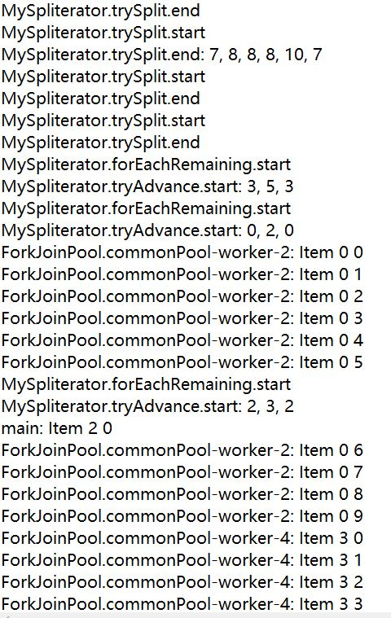

# 定制并发类

本章将学习如下内容：

- 定制ThreadPoolExecutor类
- 实现基于优先级的执行器类
- 实现ThreadFactory接口生成自定义线程 
- 执行器对象中使用自定义ThreadFactory 
- 定制在调度线程池中运行的任务 
- 实现为fork/join框架生成自定义线程的ThreadFactory接口
- 定制在fork/join框架中运行的任务
- 实现自定义Lock类
- 实现基于优先级的转移队列 
-  实现自定义原子对象
- 实现自定义流生成器
- 实现自定义异步流

## 引言

Java并发API为实现并发应用提供了许多接口和类。它们提供了低级别机制，诸如Thread类、Runnable或者Callable接口，或者synchronized关键字。它们也提供了高级别机制，例如Java 7 发行版中新增的Executor框架和fork/join框架，或者Java 8中新增的Stream框架来处理大数据集。尽管如此，在开发应用时，Java API的默认配置和/或实现依然无法满足需要。 

这种情况下，可能需要基于Java提供的工具实现定制化并发应用组件。基本上可以：

- 实现接口提供其定义的功能，例如ThreadFactory接口。 
- 重写类方法来满足需要的特性。例如，重写Phaser类的onAdvance()方法，默认情况下，不起任何作用，需要重写以提供一些功能。

通过本节学习如何修改Java并发API类特性，而无需从头设计并发框架，使用这些方法作为初始点来实现自定义功能。 

## 定制ThreadPoolExecutor类

Executor框架将线程创建与执行分开，此框架基于Executor和ExecutorService接口，以及实现这两个接口的ThreadPoolExecutor类。它包含一个内部线程池，并提供发送两种任务并在池线程中执行的方法。这些任务是：

- Runnable接口实现不返回值的任务
- Callable接口实现返回值的任务

这两种情况中，只将任务发送给执行器。executor使用其中一个池线程，或者创建一个新的线程来执行这些任务。执行器还决定任务执行的时刻。 

本节将学习如何重写ThreadPoolExecutor类方法来计算在执行器中执行的任务运行时间，且当任务完成执行时，将执行器的统计信息输出到控制台。

### 准备工作

本范例通过Eclipse开发工具实现。如果使用诸如NetBeans的开发工具，打开并创建一个新的Java项目。

### 实现过程

通过如下步骤实现范例：

1. 创建名为MyExecutor的类，继承ThreadPoolExecutor类：

   ```java
   public class MyExecutor extends ThreadPoolExecutor{
   ```

2. 声明由字符串和日期类参数化的私有ConcurrentHashMap属性，名为startTimes：

   ```java
   	private final ConcurrentHashMap<Runnable, Date> startTimes;
   ```

3. 实现类构造函数，使用super关键字和初始化startTime属性调用父类构造函数：

   ```java
   	public MyExecutor(int corePoolSize, int maximumPoolSize, long keepAliveTime, TimeUnit unit, BlockingQueue<Runnable> workQueue) {
   		super(corePoolSize, maximumPoolSize, keepAliveTime, unit,workQueue);
   		startTimes=new ConcurrentHashMap<>();
   	}
   ```

4. 重写shutdown()方法，将执行、运行和挂起任务的信息输出到控制台。使用super关键字调用父类的shutdown()方法：

   ```java
   	@Override
   	public void shutdown() {
   		System.out.printf("MyExecutor: Going to shutdown.\n");
   		System.out.printf("MyExecutor: Executed tasks: %d\n", getCompletedTaskCount());
   		System.out.printf("MyExecutor: Running tasks: %d\n", getActiveCount());
   		System.out.printf("MyExecutor: Pending tasks: %d\n", getQueue().size());
   		super.shutdown();
   	}
   ```

5. 重写shutdownNow()方法，将执行、运行和挂起任务的信息输出到控制台。使用super关键字调用父类的shutdown()方法：

   ```java
   	@Override
   	public List<Runnable> shutdownNow() {
   		System.out.printf("MyExecutor: Going to immediately shutdown.\n");
   		System.out.printf("MyExecutor: Executed tasks: %d\n", getCompletedTaskCount());
   		System.out.printf("MyExecutor: Running tasks: %d\n", getActiveCount());
   		System.out.printf("MyExecutor: Pending tasks: %d\n", getQueue().size());
   		return super.shutdownNow();
   	}
   ```

6. 重写beforeExecute()方法，将准备执行任务的线程名称和任务的哈希码输出到控制台。使用任务哈希码作为键，将开始日期存储在HashMap中：

   ```java
   	@Override
   	protected void beforeExecute(Thread t, Runnable r) {
   		System.out.printf("MyExecutor: A task is beginning: %s : %s\n", t.getName(),r.hashCode());
   		startTimes.put(r, new Date());
   	}
   ```

7. 重写afterExecute()方法，将任务结果信息输出到控制台，通过减去当前日期的HashMap中存储的任务开始日期来计算任务的运行时间：

   ```java
   	@Override
   	protected void afterExecute(Runnable r, Throwable t) {
   		Future<?> result=(Future<?>)r;
   		try {
   			System.out.printf("*********************************\n");
   			System.out.printf("MyExecutor: A task is finishing.\n");
   			System.out.printf("MyExecutor: Result: %s\n",
   			result.get());
   			Date startDate=startTimes.remove(r);
   			Date finishDate=new Date();
   			long diff=finishDate.getTime()-startDate.getTime();
   			System.out.printf("MyExecutor: Duration: %d\n",diff);
   			System.out.printf("*********************************\n");
   		} catch (InterruptedException | ExecutionException e) {
   			e.printStackTrace();
   		}
   	}
   }
   ```

8. 创建名为SleepTwoSecondsTask的类，实现String类参数化的Callable接口。实现call()方法，设置当前线程休眠2秒钟，返回转换成String类型的当前时间：

   ```java
   public class SleepTwoSecondsTask implements Callable<String>{
       public String call() throws Exception {
   		TimeUnit.SECONDS.sleep(2);
   		return new Date().toString();
   	}
   }
   ```

9. 实现本范例主类，创建名为Main的类，包含main()方法：

   ```java
   public class Main {
   	public static void main(String[] args) {
   ```

10. 创建名为myExecutor的MyExecutor对象：

    ```java
    		MyExecutor myExecutor=new MyExecutor(4, 8, 1000, TimeUnit.MILLISECONDS, new LinkedBlockingDeque<Runnable>());
    ```

11. 创建String类参数化的Future对象列表，存储将要发送到执行器的任务的结果对象：

    ```java
    		List<Future<String>> results=new ArrayList<>();
    ```

12. 提交10个Task对象：

    ```java
    		for (int i=0; i<10; i++) {
    			SleepTwoSecondsTask task=new SleepTwoSecondsTask();
    			Future<String> result=myExecutor.submit(task);
    			results.add(result);
    		}
    ```

13. 使用get()方法得到前五个任务的执行结果，输出到控制台：

    ```java
    		for (int i=0; i<5; i++){
    			try {
    				String result=results.get(i).get();
    				System.out.printf("Main: Result for Task %d : %s\n", i,result);
    			} catch (InterruptedException | ExecutionException e) {
    				e.printStackTrace();
    			}
    		}
    ```

14. 使用shutdown()方法结束执行器运行：

    ```java
    		myExecutor.shutdown();
    ```

15. 使用get()方法得到后五个任务的执行结果，输出到控制台：

    ```java
    		for (int i=5; i<10; i++){
    			try {
    				String result=results.get(i).get();
    				System.out.printf("Main: Result for Task %d : %s\n", i,result);
    			} catch (InterruptedException | ExecutionException e) {
    				e.printStackTrace();
    			}
    		}
    ```

16. 使用awaitTermination()方法等待执行器结束：

    ```java
    		try {
    			myExecutor.awaitTermination(1, TimeUnit.DAYS);
    		} catch (InterruptedException e) {
    			e.printStackTrace();
    		}
    ```

17. 将指明程序执行结束的信息输出到控制台：

    ```java
    		System.out.printf("Main: End of the program.\n");
    	}
    }
    ```

### 工作原理

在本节中，通过继承ThreadPoolExecutor类和重写其四个方法实现了定制化执行器。beforeExecute()和afterExecute()方法用来计算任务执行时间。beforeExecute()方法在任务执行前运行，使用HashMap来存储任务的启动时间。afterExecute()方法在任务执行后运行，从HashMap中的到已经执行完的任务startTime，然后计算当前时间和startTime的差值得到任务的执行时间。还重写了shutdown()和shutdownNow()方法将执行器中任务执行的统计信息输出到控制台。这些任务包括：

- 执行的任务，使用getCompletedTaskCount()方法
- 当前运行的任务，使用getActiveCount()方法
- 待完成任务，使用阻塞队列的size()方法，执行器在其中存储挂起的任务

实现Callable接口的SleepTwoSecondsTask类将其执行线程休眠2秒，主类将10个任务发送给执行器，并使用执行器和其它类演示对应特性。 

执行程序将看到其如何显示正在运行的每个任务的时间跨度，以及调用shutdown()方法时执行程序的统计信息。

### 更多关注

- 第四章“线程执行器”中的“创建线程执行器并控制其被拒任务”小节
- 本章“执行器对象中使用自定义ThreadFactory”小节

## 实现基于优先级的执行器类

在Java并发API的第一代版本中，是必须要创建和运行应用中的所有线程。在Java版本5中，随着Executor框架的出现 ，引入了一种新的机制来执行并发任务。

使用执行器框架，只需要实现任务且发送它们到执行器。执行器负责创建和执行线程，而这些线程用来运行任务。

执行器在内部使用阻塞队列存储延迟任务，这些任务按照到达执行器的顺序排列。 一种可能的替代方法是使用优先队列存储新任务。如果一个具有高优先级的新任务到达执行器，它将在已等待但具有相对较低优先级的其他所有线程之前执行。 

本节将学习如何调整执行器，使用优先级队列存储待发送执行的任务。

### 准备工作

本范例通过Eclipse开发工具实现。如果使用诸如NetBeans的开发工具，打开并创建一个新的Java项目。

### 实现过程

通过如下步骤实现范例：

1. 创建名为MyPriorityTask的类，实现Runnable和MyPriorityTask类接口参数化的Comparable接口：

   ```java
   public class MyPriorityTask implements Runnable, Comparable<MyPriorityTask>{
   ```

2. 声明名为priority的私有int属性：

   ```java
   	private int priority;
   ```

3. 声明名为那么的私有String属性：

   ```java
   	private String name;
   ```

4. 实现类构造函数，初始化属性：

   ```java
   	public MyPriorityTask(String name, int priority) {
   		this.name=name;
   		this.priority=priority;
   	}
   ```

5. 实现返回优先级属性值的方法：

   ```java
   	public int getPriority(){
   		return priority;
   	}
   ```

6. 实现声明在Comparable接口中的compareTo()方法。它将MyPriorityTask对象作为参数接收，并比较当前对象和作为参数的对象的优先级。设置高优先级任务在低优先级任务之前执行：

   ```java
   	@Override
   	public int compareTo(MyPriorityTask o) {
   		return Integer.compare(o.getPriority(), this.getPriority());
   	}
   ```

7. 实现run()方法，设置当前线程休眠2秒钟：

   ```java
   	@Override
   	public void run() {
   		System.out.printf("MyPriorityTask: %s Priority : %d\n",name,priority);
   		try {
   			TimeUnit.SECONDS.sleep(2);
   		} catch (InterruptedException e) {
   			e.printStackTrace();
   			Thread.currentThread().interrupt();
   		}
   	}
   }
   ```

8. 通过创建名为Main的类，添加main()方法，实现本范例主类：

   ```java
   public class Main {
   	public static void main(String[] args) {
   ```

9. 创建名为executor的ThreadPoolExecutor对象，使用Runnable接口参数化的PriorityBlockingQueue，作为存储此执行器存储延迟任务的队列：

   ```java
   		ThreadPoolExecutor executor=new ThreadPoolExecutor(4,4,1, TimeUnit.SECONDS, new PriorityBlockingQueue<Runnable>());
   ```

10. 使用循环计数器作为任务的优先级，发送10个任务到执行器。使用execute()方法发送任务到执行器：

    ```java
    		for (int i=0; i<10; i++){
    			MyPriorityTask task=new MyPriorityTask ("Task "+i,i);
    			executor.execute(task);
    		}
    ```

11. 设置当前线程休眠1秒钟：

    ```java
    		try {
    			TimeUnit.SECONDS.sleep(1);
    		} catch (InterruptedException e) {
    			e.printStackTrace();
    		}
    ```

12. 使用循环计数器作为任务的优先级，发送额外10个任务到执行器。使用execute()方法发送任务到执行器：

    ```java
    		for (int i=10; i<20; i++) {
    			MyPriorityTask task=new MyPriorityTask ("Task "+i,i);
    			executor.execute(task);
    		}
    ```

13. 使用shutdown()方法关闭执行器：

    ```java
    		executor.shutdown();
    ```

14. 使用awaitTermination()方法等待执行器结束：

    ```java
    		try {
    			executor.awaitTermination(1, TimeUnit.DAYS);
    		} catch (InterruptedException e) {
    			e.printStackTrace();
    		}	
    ```

15. 输出指明程序结束的信息到控制台：

    ```java
    		System.out.printf("Main: End of the program.\n");
    	}
    }
    ```

### 工作原理

将常规执行器转换为基于优先级的执行器很简单。只需要将Runnable接口参数化的PriorityBlockingQueue对象作为参数传递。但对于执行器，存储在优先级队列中的所有对象必须实现Comparable接口。

我们实现了MyPriorityTask类，此接口实现Runnable接口，作为任务和存储在优先级队列中的Comparable接口。此类包含用于存储任务优先级的Priority属性，属性值高的任务将先被执行，compareTo()方法在优先级队列中确定任务的排序。在Main类中，发送20个具有不同优先级的任务执行器，首个发送到执行器的任务将被第一个执行。当执行器空闲时，任务只要到达就会立即执行第一个任务。我们创建了包含四个执行线程的执行器，所以头四个任务将第一批被执行，然后剩下的任务将基于优先级的顺序执行。

下图显示本范例在控制台输出的执行信息：


### 扩展学习

通过配置Executor可以使用BlockingQueue接口的任何实现。 其中DelayQueue类用来存储延迟活动的元素，此类提供只返回活动对象的方法。可以使用此类实现ScheduledThreadPoolExecutor类的自定义版本。

### 更多关注

- 第四章“线程执行器”中的“创建线程执行器并控制其被拒任务”小节
- 本章“定制ThreadPoolExecutor类”小节
- 第七章“并发集合”中的“使用按优先级排序的阻塞线程安全队列”小节

## 实现ThreadFactory接口生成自定义线程 

在面向对象编程领域中，工厂模式是广泛使用的设计模式，创造性的通过开发类来创建一个或多个类的对象。当想要创建其中一个类的对象时，我们使用工厂来代替新的操作符。

> 考虑到在创建具有有限资源的对象时所遇到的限制，在工厂模式中将对对象创建集中化，因此在更改创建的对象类或者对象方式上更有优势。例如，只有一个类型的N个对象，就能够轻松地生成关于对象创建的统计数据。 

Java提供ThreadFactory接口来实现Thread对象工厂。Java并发API中一些高级功能，例如fork/join的Executor框架，就使用线程工厂创建线程。Java并发API中里一个工厂模式的例子是Executors类，它提供了大量创建不同类别的Executor对象的方法。本节将通过继承Thread类添加新功能，实现一个新的线程工厂类来生成线程。

### 准备工作

本范例通过Eclipse开发工具实现。如果使用诸如NetBeans的开发工具，打开并创建一个新的Java项目。

### 实现过程

通过如下步骤实现范例：

1. 创建名为MyThread的类，继承Thread类：

   ```java
   public class MyThread extends Thread{
   ```

2. 声明名为creationDate、startDate和finishDate三个私有Date属性：

   ```java
   	private final Date creationDate;
   	private Date startDate;
   	private Date finishDate;
   ```

3. 实现类构造函数，将name和待执行的Runnable对象作为参数接收。初始化线程的创建时间：

   ```java
   	public MyThread(Runnable target, String name ){
   		super(target,name);
   		creationDate = new Date();
   	}
   ```

4. 实现run()方法，存储线程的起始时间，调用父类的run()方法，存储执行的结束时间：

   ```java
   	@Override
   	public void run() {
   		setStartDate();
   		super.run();
   		setFinishDate();
   	}
   ```

5. 实现建立startDate属性值的方法：

   ```java
   	public synchronized void setStartDate() {
   		startDate=new Date();
   	}
   ```

6. 实现建立finishDate属性值的方法：

   ```java
   	public synchronized void setFinishDate() {
   		finishDate=new Date();
   	}
   ```

7. 实现名为getExecutionTime()的方法，通过完成时间与开始时间的差值来计算线程的执行时间：

   ```java
   	public synchronized long getExecutionTime() {
   		return finishDate.getTime()-startDate.getTime();
   	}
   ```

8. 重写toString()方法，返回线程的创建时间和执行时间：

   ```java
   	@Override
   	public synchronized String toString(){
   		StringBuilder buffer=new StringBuilder();
   		buffer.append(getName());
   		buffer.append(": ");
   		buffer.append(" Creation Date: ");
   		buffer.append(creationDate);
   		buffer.append(" : Running time: ");
   		buffer.append(getExecutionTime());
   		buffer.append(" Milliseconds.");
   		return buffer.toString();
   	}
   }
   ```

9. 创建名为MyThreadFactory的类，实现ThreadFactory接口：

   ```java
   public class MyThreadFactory implements ThreadFactory{
   ```

10. 声明名为counter的私有AtomicInteger属性：

    ```java
    	private AtomicInteger counter;
    ```

11. 声明名为prefix的私有String属性：

    ```java
    	private String prefix;
    ```

12. 实现类构造函数，初始化属性：

    ```java
    	public MyThreadFactory (String prefix) {
    		this.prefix=prefix;
    		counter=new AtomicInteger(1);
    	}
    ```

13. 实现newThread()方法，创建MyThread对象且递增counter属性：

    ```java
    	@Override
    	public Thread newThread(Runnable r) {
    		MyThread myThread=new MyThread(r,prefix+"-"+counter.getAndIncrement());
    		return myThread;
    	}
    }
    ```

14. 创建名为MyTask的类来实现Runnable接口，实现run()方法，设置当前线程休眠2秒钟：

    ```java
    public class MyTask implements Runnable{
    	@Override
    	public void run() {
    		try {
    			TimeUnit.SECONDS.sleep(2);
    		} catch (InterruptedException e) {
    			e.printStackTrace();
    		}
    	}
    }
    ```

15. 通过创建名为Main的类，添加main()方法，实现本范例主类：

    ```java
    public class Main {
    	public static void main(String[] args) throws Exception {
    ```

16. 创建MyThreadFactory对象：

    ```java
    		MyThreadFactory myFactory=new MyThreadFactory("MyThreadFactory");
    ```

17. 创建Task对象：

    ```java
    		MyTask task=new MyTask();
    ```

18. 使用工厂的newThread()方法创建MyThread对象，用来执行任务：

    ```java
    		Thread thread=myFactory.newThread(task);
    ```

19. 启动线程，然后等待线程结束：

    ```java
    		thread.start();
    		thread.join();
    ```

20. 使用toString()方法输出线程信息到控制台：

    ```java
    		System.out.printf("Main: Thread information.\n");
    		System.out.printf("%s\n",thread);
    		System.out.printf("Main: End of the example.\n");
    	}
    }
    ```

### 工作原理

本节通过继承Thread类实现了定制化的Mythread类。此类包含三个属性，分别存储线程创建和执行的开始时间，以及线程执行的结束时间。使用开始和结束时间属性，实现了getExecutionTime()方法，返回线程在执行任务时消耗的总时间。最后，重写toString()方法生成线程相关信息。

一旦线程类自定义后，就通过实现ThreadFactory接口生成一个工厂来创建类对象。如果要将工厂作为独立对象，则不需要强制使用此接口，但是如果要将此工厂与Java并发API的其他类一起使用，则必须通过实现此接口来构建工厂。ThreadFactory接口只有一个方法：newThread()方法。此方法将Runnble对象作为参数接收，并返回Thread对象来执行Runnable对象。本范例中返回MyThread对象。

为了检查这两个类，实现MyTask类，在MyThread对象管理的线程中执行的任务 ，此类实现Runnable接口。一个MyTask实例设置其执行线程休眠2秒钟。

在本范例主方法中，使用执行Task对象的MyThreadFactory工厂来创建MyThread对象。如果执行本范例，将会看到线程启动时间和线程执行时间的信息。

下图显示本范例在控制台输出的执行信息：


### 扩展学习

Java并发API提供Executors类来生成线程执行器，通常是ThreadPoolExecutor类的对象。还可以使用此类获得ThreadFactory接口的最基本实现，通过使用defaultThreadFactory()方法。此方法生成的工厂创建属于同一个ThreadGroup对象的基本线程对象，ThreadFactory接口可以用于任何目的，不只是与Executor框架相关。 

## 执行器对象中使用自定义ThreadFactory

在上一节中，我们介绍了工厂模式，并通过ThreadFactory接口，提供了如何实现线程工厂的范例。

Executor框架是一种将线程创建和执行分开的机制。它基于Executor和ExecutorService接口，以及实现这两个接口的ThreadPoolExecutor类。此框架包含一个内部线程池，并提供方法发送两种任务到池线程中执行它们，这两种任务如下所示：

- 实现Runnable接口的类，实现不返回值的任务
- 实现Callable接口的类，实现返回值的任务

Executor框架在内部使用ThreadFactory接口创建线程，用于生成新线程。本节将学习如何实现自定义线程类和线程工厂来创建此类的线程，以及如何在执行器中使用这个工厂来执行这些线程。  

### 准备工作

本范例通过Eclipse开发工具实现。如果使用诸如NetBeans的开发工具，打开并创建一个新的Java项目。

### 实现过程

通过如下步骤实现范例：

1. 复制MyThread、MyThreadFactory和MyTask类到工程中，它们在“”小节中实现，本范例中将使用到这些类。

2. 通过创建名为Main的类，添加main()方法，实现本范例主类：

   ```java
   public class Main {
   	public static void main(String[] args) throws Exception{
   ```

3. 创建名为threadFactory的新的MyThreadFactory对象：

   ```java
   		MyThreadFactory threadFactory=new MyThreadFactory("MyThreadFactory");
   ```

4. 使用Executors类的newCachedThreadPool()方法创建新的Executor对象，将之前创建的工厂对象作为参数传递。新的Executor对象将使用这个工厂创建必要的线程，所以它将执行MyThread线程：

   ```java
   		ExecutorService executor=Executors.newCachedThreadPool(threadFactory);
   ```

5. 创建新的Task对象，使用submit()方法将此对象发送到执行器：

   ```java
   		MyTask task=new MyTask();
   		executor.submit(task);
   ```

6. 使用shutdown()方法关闭执行器：

   ```java
   		executor.shutdown();
   ```

7. 使用awaitTermination()方法等待执行器结束：

   ```java
   		executor.awaitTermination(1, TimeUnit.DAYS);
   ```

8. 输出指明程序终止的信息到控制台：

   ```java
   		System.out.printf("Main: End of the program.\n");
   	}
   }
   ```

   

### 工作原理

在上节“工作原理”中，详细解释了MyThread、MyThreadFactory和MyTask类的工作原理。

本范例的main()方法中，使用Executors类的newCachedThreadPool()方法创建Executor对象，将之前创建的工厂对象作为参数传递，所以创建的Executor对象将使用此工厂创建它所需要的线程，并且还执行MyThread类的线程。

执行程序将看到关于线程启动时间和执行时间的信息，下图显示本范例在控制台输出的执行信息：


### 更多关注

本章“实现为fork/join框架生成自定义线程的ThreadFactory接口”小节

## 定制在调度线程池中运行的任务 

调度线程池是Executor框架基本线程池的扩展，调度在一段时间后执行任务。ScheduledThreadPoolExecutor类实现此线程池，并且允许如下两种任务的执行：

- **延迟任务：**在一段时间后只执行一次的任务
- **周期任务：**在延迟之后且持续周期性执行的任务

延迟任务能够执行Callable和Runnable对象，但周期任务只能执行Runnable对象。所有通过调度线程池执行的任务都是RunnableScheduledFuture接口实现。本节将学习如何实现自定义RunnableScheduledFuture接口，来执行延迟和周期任务。

### 准备工作

本范例通过Eclipse开发工具实现。如果使用诸如NetBeans的开发工具，打开并创建一个新的Java项目。

### 实现过程

通过如下步骤实现范例：

1. 创建名为MyScheduledTask的类，此类由名为V的泛型类型参数化，继承FutureTask类且实现RunnableScheduledFuture接口：

   ```java
   public class MyScheduledTask<V> extends FutureTask<V> implements RunnableScheduledFuture<V> {
   ```

2. 声明名为task的私有RunnableScheduledFuture属性：

   ```java
   	private RunnableScheduledFuture<V> task;
   ```

3. 声明名为executor的私有ScheduledThreadPoolExecutor类：

   ```java
   	private ScheduledThreadPoolExecutor executor;
   ```

4. 声明名为period的私有long属性：

   ```java
   	private long period;
   ```

5. 声明名为startDate的私有long属性：

   ```java
   	private long startDate;
   ```

6. 实现类构造函数，接收任务将要执行的Runnable对象，任务返回的结果，创建MyScheduledTask对象的RunnableScheduledFuture任务，和将要执行任务的ScheduledThreadPoolExecutor对象。调用其父类构造函数，并存储task和executor属性：

   ```java
   	public MyScheduledTask(Runnable runnable, V result, RunnableScheduledFuture<V> task, ScheduledThreadPoolExecutor executor) {
   		super(runnable, result);
   		this.task=task;
   		this.executor=executor;
   	}
   ```

7. 实现getDelay()方法，如果任务是周期的且startDate属性值大于零，计算实际时间和startDate的差值作为返回值。否则返回task属性中存储的初始任务延迟时间。切记必须在作为参数传递的时间单元中返回结果：

   ```java
   	@Override
   	public long getDelay(TimeUnit unit) {
   		if (!isPeriodic()) {
   			return task.getDelay(unit);
   		} else {
   			if (startDate==0){
   				return task.getDelay(unit);
   			} else {
   				Date now=new Date();
   				long delay=startDate-now.getTime();
   				return unit.convert(delay, TimeUnit.MILLISECONDS);
   			}
   		}
   	}
   ```

8. 实现compareTo()方法，调用初始任务的compareTo()方法：

   ```java
   	@Override
   	public int compareTo(Delayed o) {
   		return task.compareTo(o);
   	}
   ```

9. 实现isPerodic()方法，调用初始任务的isPerodic()方法：

   ```java
   	@Override
   	public boolean isPeriodic() {
   		return task.isPeriodic();
   	}
   ```

10. 实现run()方法，如果是周期任务，则必须使用任务下次执行的开始时间更新startDate属性，属性值为实际时间和周期的总和。然后再次把任务添加到ScheduledThreadPoolExecutor对象队列中：

    ```java
    	@Override
    	public void run() {
    		if (isPeriodic() && (!executor.isShutdown())) {
    			Date now=new Date();
    			startDate=now.getTime()+period;
    			executor.getQueue().add(this);
    		}
    ```

11. 输出实际时间到控制台，调用runAndReset()方法执行此任务，然后输出再次执行的实际时间到控制台：

    ```java
    		System.out.printf("Pre-MyScheduledTask: %s\n",new Date());
    		System.out.printf("MyScheduledTask: Is Periodic: %s\n",
    		isPeriodic());
    		super.runAndReset();
    		System.out.printf("Post-MyScheduledTask: %s\n",new Date());
    	}
    ```

12. 实现setPeriod()方法设置任务周期：

    ```java
    	public void setPeriod(long period) {
    		this.period=period;
    	}
    }
    ```

13. 创建名为MyScheduledThreadPoolExecutor的类，实现执行MyScheduledTask任务的ScheduledThreadPoolExecutor对象。指定此类继承ScheduledThreadPoolExecutor类：

    ```java
    public class MyScheduledThreadPoolExecutor extends ScheduledThreadPoolExecutor{
    ```

14. 实现只调用父类构造函数的类构造函数：

    ```java
    	public MyScheduledThreadPoolExecutor(int corePoolSize) {
    		super(corePoolSize);
    	}
    ```

15. 实现decorateTask()方法，将待执行的Runnable对象和执行此对象的RunnableScheduledFuture任务作为参数接收，创建并返回MyScheduledTask任务，使用这些对象来构造它们：

    ```java
    	@Override
    	protected <V> RunnableScheduledFuture<V> decorateTask(Runnable runnable, RunnableScheduledFuture<V> task) {
    		MyScheduledTask<V> myTask=new MyScheduledTask<V>(runnable, null, task,this);
    		return myTask;
    	}
    ```

16. 重写scheduledAtFixedRate()方法，调用其父类方法，将返回对象转换成MyScheduledTask对象，使用setPeriod()方法设置任务的周期：

    ```java
    	@Override
    	public ScheduledFuture<?> scheduleAtFixedRate(Runnable command, long initialDelay, long period, TimeUnit unit) {
    		ScheduledFuture<?> task= super.scheduleAtFixedRate(command, initialDelay, period, unit);
    		MyScheduledTask<?> myTask=(MyScheduledTask<?>)task;
    		myTask.setPeriod(TimeUnit.MILLISECONDS.convert(period,unit));
    		return task;
    	}
    }
    ```

17. 创建名为Task的类，实现Runnable接口：

    ```java
    public class Task implements Runnable {
    ```

18. 实现run()方法，输出任务启动信息，设置当前线程休眠2秒钟，然后输出任务结束信息：

    ```java
    	@Override
    	public void run() {
    	System.out.printf("Task: Begin.\n");
    		try {
    			TimeUnit.SECONDS.sleep(2);
    		} catch (InterruptedException e) {
    			e.printStackTrace();
    		}
    		System.out.printf("Task: End.\n");
    	}
    }
    ```

19. 通过创建名为Main的类，添加main()方法，实现本范例主类：

    ```java
    public class Main {
    	public static void main(String[] args)  throws Exception{
    ```

20. 创建名为executor的MyScheduledThreadPoolExecutor对象，使用4作为参数，池中包含两个线程：

    ```java
    		MyScheduledThreadPoolExecutor executor=new MyScheduledThreadPoolExecutor(4);
    ```

21. 创建名为task的Task对象，输出实际时间到控制台：

    ```java
    		Task task=new Task();
    		System.out.printf("Main: %s\n",new Date());
    ```

22. 使用schedule()方法发送延迟任务到执行器，此任务将延迟1秒后执行：

    ```java
    		executor.schedule(task, 1, TimeUnit.SECONDS);
    ```

23. 设置主线程休眠3秒钟：

    ```java
    		TimeUnit.SECONDS.sleep(3);
    ```

24. 创建另一个Task对象，再次输出实际时间到控制台：

    ```java
    		task=new Task();
    		System.out.printf("Main: %s\n",new Date());
    ```

25. 使用scheduleAtFixedRate()方法发送周期任务到执行器，此任务将延迟1秒后执行，且每3秒钟执行一次：

    ```java
    		executor.scheduleAtFixedRate(task, 1, 3, TimeUnit.SECONDS);
    ```

26. 设置主线程休眠10秒钟：

    ```java
    		TimeUnit.SECONDS.sleep(10);
    ```

27. 使用shutdown()方法关闭执行器，使用awaitTermination()方法等待执行器结束：

    ```java
    		executor.shutdown();
    		executor.awaitTermination(1, TimeUnit.DAYS);
    ```

28. 输出指明程序结束的信息到控制台：

    ```java
    		System.out.printf("Main: End of the program.\n");
    	}
    }
    ```

### 工作原理

在本节中，实现了MyScheduledTask类，用来实现在ScheduledThreadPoolExecutor执行器上执行的定制化任务。此类继承FutureTask类和实现RunnableScheduledFuture接口。它实现RunnableScheduledFuture接口是因为所有在调度执行器中运行的任务必须实现此接口且继承FutureTask类。这是因为此类正确地实现了RunnableScheduledFuture接口中声明的方法。之前提到的所有接口和类都是参数化类，它们具有通过任务返回的数据类型。 

为了在调度执行器中使用MyScheduledTask任务，重写了MyScheduledThreadPoolExecutor类的decorateTask()方法。此类继承ScheduledThreadPoolExecutor执行器，并且此方法将ScheduledThreadPoolExecutor执行器实现的默认调度任务转换成MyScheduledTask任务。所以，当实现自定义的调度任务时，还需要实现自定义调度执行器。

> decorateTask()方法创建新的MyScheduledTask对象，包含四个参数。第一个参数是任务中待执行的Runnable对象；第二个参数是通过任务待返回的对象；第三个参数是线程池中待替换的新对象；最后一个对象是将要执行任务的执行器。本范例中，使用this关键字来引用正在创建任务的执行器。

 MyScheduledTask类可以执行延迟和周期任务，通过实现getDelay()和run()方法，包含必要的逻辑操作来执行这两种任务。

调度执行器通过调用getDelay()方法知道是否需要执行任务，此方法特性在延迟和周期任务中改变。如前所述，MyScheduledClass类构造函数接收准备执行 Runnable对象的初始ScheduledRunnableFuture对象，且存储此对象为类属性，用来访问类方法和数据。当执行延迟任务时，getDelay()方法返回初始任务的延迟时间。但处理周期任务时，getDelay()方法返回任务执行的实际时间和startDate的差值。

run()方法是执行任务的方法，周期任务特点是，如果希望再次执行任务，则必须将下一个执行任务作为新任务放在执行器的队列中。所以如果执行周期任务，则设置startDate属性值为任务执行的实际时间和区间，并将任务再次存储在执行器的队列中。startDate属性存储下一个任务开始执行时间，然后使用FutureTask类提供的runAndReset()方法执行任务。处理延迟任务不需要将任务放置到执行器队列中，因为延迟任务只执行一次。

> 还需要注意执行器是否已经关闭。如果是，则不需要再次将周期任务存储到执行器队列中。

最后，重写MyScheduledThreadPoolExecutor类的scheduleAtFixedRate()方法。我们之前提到对于周期任务，使用任务周期设置startDate属性值，但是我们还没有初始化周期。所以需要重写此方法，将周期作为参数接收，将周期传给MyScheduledTask类才能使用。

本范例完成了实现Runnable接口的任务类，它是在调度执行器中执行的任务。范例主类创建MyScheduledThreadPoolExecutor执行器，且返回如下两个任务：

- 延迟任务，在实际时间1秒后执行
- 周期认为，在实际时间1秒后执行，然后每个3秒执行一次

下图显示本范例在控制台输出的执行信息，可以检查是否正确执行这两种任务：


### 扩展学习

ScheduledThreadPoolExecutor类提供decorateTask()方法的另一个版本，此方法将Callable对象代替Runnable对象作为参数接收。

### 更多关注

- 第四章“线程执行器”中的“执行器中延迟运行任务”和“执行器中周期运行任务”小节

## 实现为fork/join框架生成自定义线程的ThreadFactory接口

fork/join框架是Java9中最有趣的特性之一，它是Executor和ExecutorService接口的实现，能够直接执行Callable和Runnable任务，无需管理执行它们的线程。

此执行器目标是执行可以划分为更小部分的任务，其主要组成部分如下：

- 由ForkJoinTask类实现的特殊任务。
- 提供两个操作，用于将任务划分为子任务（fork操作）和等待这些子任务结束（join操作）。 
- 它是一种命名为“工作窃取”的算法，优化线程池的使用。当任务等待其子任务时，正在执行此任务的线程会去运行其它任务。

fork/join框架的主类是ForkJoinPool类。在内部包括如下两个元素：

- 等待被执行的任务队列
- 执行任务的线程池

ForkJoinWorkerThread向Thread类添加新方法，比如创建线程时执行的onStart()方法和清理线程使用资源时调用的onTermination()方法。ForkJoinPool类使用ForkJoinWorkerThreadFactory接口的实现来创建其使用的工作线程。

本节将学习如何实现在ForkJoinPool类中使用的定制工作线程，以及在继承ForkJoinPool类和实现ForkJoinWorkerThreadFactory接口的工厂中如何使用此线程。

### 准备工作

本范例通过Eclipse开发工具实现。如果使用诸如NetBeans的开发工具，打开并创建一个新的Java项目。

### 实现过程

通过如下步骤实现范例：

1. 创建名为MyWorkerThread的类，继承ForkJoinWorkerThread类：

   ```java
   public class MyWorkerThread extends ForkJoinWorkerThread{
   ```

2. 声明和创建ThreadLocal属性，由名为taskCounter的Integer类参数化：

   ```java
   	private final static ThreadLocal<Integer> taskCounter= new ThreadLocal<Integer>();
   ```

3. 实现类构造函数： 

   ```java
   	protected MyWorkerThread(ForkJoinPool pool) {
   		super(pool);
   	}
   ```

4. 重写onStart()方法，在其父类上调用此方法输出信息到控制条，且设置这个线程的taskCounter属性值为零：

   ```java
   	@Override
   	protected void onStart() {
   		super.onStart();
   		System.out.printf("MyWorkerThread %d: Initializing task counter.\n", getId());	
   		taskCounter.set(0);
   	}
   ```

5. 重写onTermination()方法，输出此线程的taskCounter属性值到控制台：

   ```java
   	@Override
   	protected void onTermination(Throwable exception) {
   		System.out.printf("MyWorkerThread %d: %d\n",
   		getId(),taskCounter.get());
   		super.onTermination(exception);
   	}
   ```

6. 实现addTask()方法，递增taskCounter属性值：

   ```java
   	public void addTask(){
   		taskCounter.set(taskCounter.get() + 1);;
   	}
   }
   ```

7. 创建名为MyWorkerThreadFactory的类，实现ForkJoinWorkerThreadFactory接口。实现newThread()方法，创建和返回MyWorkerThread对象：

   ```java
   public class MyWorkerThreadFactory  implements ForkJoinWorkerThreadFactory{
   	@Override
   	public ForkJoinWorkerThread newThread(ForkJoinPool pool) {
   		return new MyWorkerThread(pool);
   	}
   }
   ```

8. 创建名为MyRecursiveTask的类，继承Integer类参数化的RecursiveTask类：

   ```java
   public class MyRecursiveTask extends RecursiveTask<Integer> {
   ```

9. 定义名为array的私有int数组：

   ```java
   	private int array[];
   ```

10. 定义名为start和end的两个私有int属性：

    ```java
    	private int start, end;
    ```

11. 实现类构造函数，初始化这些属性：

    ```java
    	public MyRecursiveTask(int array[],int start, int end) {
    		this.array=array;
    		this.start=start;
    		this.end=end;
    	}
    ```

12. 实现compute()方法，将数组中开始和结束位置之间所有元素相加。首先将正在执行任务的线程转换成MyWorkerThread对象，并且使用addTask()为此线程递增任务的计数：

    ```java
    	@Override
    	protected Integer compute() {
    		Integer ret;
    		MyWorkerThread thread=(MyWorkerThread)Thread.currentThread();
    		thread.addTask();
    ```

13. 如果数组中开始和结束位置区间的元素数大于100，计算中间位置且创建两个新的MyRecursiveTask任务分别处理前后两部分。如果区间等于或小于100，计算开始和结束位置区间所有元素的和：

    ```java
    		if (end-start>100) {
    			int mid=(start+end)/2;
    			MyRecursiveTask task1=new MyRecursiveTask(array,start,mid);
    			MyRecursiveTask task2=new MyRecursiveTask(array,mid,end);
    			invokeAll(task1,task2);
    			ret=addResults(task1,task2);
    		} else {
    			int add=0;
    			for (int i=start; i<end; i++) {
    				add+=array[i];
    			}
    			ret=add;
    		}
    ```

14. 设置线程休眠10毫秒，返回任务结果：

    ```java
    		try {
    			TimeUnit.MILLISECONDS.sleep(10);
    		} catch (InterruptedException e) {
    			e.printStackTrace();
    		}
    		return ret;
    	}
    ```

15. 实现addResults()接口，计算并返回作为参数接收的两个任务的结果之和: 

    ```java
    	private Integer addResults(MyRecursiveTask task1, MyRecursiveTask task2) {
    		int value;
    		try {
    			value = task1.get().intValue()+task2.get().intValue();
    		} catch (InterruptedException e) {
    			e.printStackTrace();
    			value=0;
    		} catch (Exception e) {
    			e.printStackTrace();
    			value=0;
    		}	
    		return value;
    	}
    }
    ```

16. 通过创建名为Main的类，添加main()方法，实现本范例主类：

    ```java
    public class Main {
    	public static void main(String[] args)  throws Exception{
    ```

17. 创建名为factory的MyWorkerThreadFactory对象：

    ```java
    		MyWorkerThreadFactory factory=new MyWorkerThreadFactory();
    ```

18. 创建名为pool的ForkJoinPool对象，传递之前创建的factory对象到构造函数：

    ```java
    		ForkJoinPool pool=new ForkJoinPool(4, factory, null, false);
    ```

19. 创建100000个整数的数组，初始化所有元素为1：

    ```java
    		int array[]=new int[100000];
    		for (int i=0; i<array.length; i++){
    			array[i]=1;
    		}
    ```

20. 创建新的task对象，计算数组中所有元素的和：

    ```java
    		MyRecursiveTask task=new MyRecursiveTask(array,0,array.length);
    ```

21. 使用execute()方法发送任务到线程池：

    ```java
    		pool.execute(task);
    ```

22. 使用join()方法等待任务结束：

    ```java
    		task.join();
    ```

23. 使用shutdown()方法关闭线程池：

    ```java
    		pool.shutdown();
    ```

24. 使用awaitTermination()方法等待执行器结束：

    ```java
    		pool.awaitTermination(1, TimeUnit.DAYS);
    ```

25. 使用get()方法，输出任务结果到控制台：

    ```java
    		System.out.printf("Main: Result: %d\n",task.get());
    ```

26. 输出指明程序结束的信息到控制台：

    ```java
    		System.out.printf("Main: End of the program\n");
    	}
    }
    ```

### 工作原理

fork/join框架使用的线程称为工作线程。 Java提供ForkJoinWorkerThread类，此类继承了Thread类并实现fork/join框架使用的工作线程。 

本节实现了继承ForkJoinWorkerThread类的MyWorkerThread类，并重写ForkJoinWorkerThread类的两个方法。范例目标是在每个工作线程中实现任务计数器，以便了解一个工作线程已经执行多少任务。通过ThreadLocal属性实现计数器，这样每个线程都将以透明的方式拥有自己的计数器。 

重写ForkJoinWorkerThread类的onStart()方法初始化任务计数器，当工作线程开始执行时调用此方法。还重写了onTermination()方法输出任务计数器的值到控制台，当工作线程结束执行时调用此方法。此外，在MyWorkerThread类中实现了addTask()方法，用来递增每个线程的任务计数器。

ForkJoinPool类像Java并发API中所有执行器一样，使用工厂来创建线程。所以如果在ForkJoinPool类中使用MyWorkerThread线程，需要实现自定义的线程工厂。对于fork/join框架框架，这个工厂需要实现ForkJoinPool.ForkJoinWorkerThreadFactory类，此类只有一个方法来创建新的MyWorkerThread对象。

最后，只要使用已经创建的工厂初始化ForkJoinPool类，也就是在Main类中所做的，使用ForkJoinPool类构造函数。

下图显示本范例在控制台输出的部分执行信息：


可以看到ForkJoinPool对象如何执行四个工作线程，以及每个线程执行多少个任务。

### 扩展学习

需要注意当线程正常结束或者抛出异常时，才会调用ForkJoinWorkerThread类提供的onTermination()方法。此方法将Throwable对象作为参数接收，如果参数值为null，工作线程正常结束，但如果参数值不为空，线程抛出异常，所以需要编写必要的程序来处理这种情形。    

### 更多关注

- 第五章“Fork/Join框架”中的“创建fork/join池”小节
- 第一章“线程管理”中的“工厂模式创建线程”小节

## 定制在fork/join框架中运行的任务

Executor框架将任务创建和执行分开，使用此框架，只需要实现Runnable对象和使用Executor对象。只要把Runnable任务发送给执行器，它就会创建、管理和结束必要的线程来执行这些任务。

Java 9在fork/join框架（Java 7中引入）中提供一种特殊的执行器，这个框架是用来解决如何使用分治技术将问题分解成更小的任务而设计的。在任务中，检查想要解决的问题的规模，如果问题规模大于设置的大小，则将问题划分为两个或多个任务，并使用此框架执行它们。如果问题规模小于设置的大小，则在任务中直接解决问题，且可选择的返回结果。fork/join框架实现了工作窃取算法，用来改善这类问题的整体性能。

fork/join框架的主类是ForkJoinPool类，在内部有如下两个元素：

- 等待被执行的任务队列
- 执行任务的线程池

默认情况下，ForkJoinPool类执行的任务是ForkJoinTask类的对象。也可以发送Runnable和Callable对象到ForkJoinPool类，但它们不能充分利用fork/join框架的所有优点。通常，把forkjoinask类的两个子类中的一个发送到ForkJoinPool对象： 

- RecursiveAction：如果任务不返回结果
- RecursiveTask：如果任务返回结果

本节将通过实现继承ForkJoinTask类的任务为fork/join框架实现自定义的任务。将要实现的任务度量其执行时间并将结果输出到控制台，以便控制其运行进度。还可以实现自定义fork/join任务，输出日志信息来获取任务中使用的资源，或者后处理任务结果。

### 实现过程

通过如下步骤实现范例：

1. 创建名为MyWorkerTask的类，指定其继承Void类型参数化的ForkJoinTask类：

   ```java
   public class MyWorkerThread extends ForkJoinWorkerThread{
   ```

2. 定义名为name的私有String属性，存储任务的名称：

   ```java
   	private final static ThreadLocal<Integer> taskCounter= new ThreadLocal<Integer>();
   ```

3. 实现类构造函数，初始化属性：

   ```java
   	protected MyWorkerThread(ForkJoinPool pool) {
   		super(pool);
   	}
   ```

4. 实现getRawResult()方法，这是ForkJoinTask类的一个抽象方法。由于MyWorkerTask任务不会返回任何结果，所以此方法必须返回null：

   ```java
   	@Override
   	public Void getRawResult() {
   		return null;
   	}
   ```

5. 实现setRawResult()方法，这是ForkJoinTask类的另一个抽象方法。由于MyWorkerTask任务不会返回任何结果，所以不用写程序：

   ```java
   	@Override
   	protected void setRawResult(Void value) {
   	}
   ```

6. 实现exec()方法，这是任务的main方法。这里将任务的逻辑委托给compute()方法，计算此方法的执行时间，并输出到控制台：

   ```java
   	@Override
   	protected boolean exec() {
   		Date startDate=new Date();
   		compute();
   		Date finishDate=new Date();
   		long diff=finishDate.getTime()-startDate.getTime();
   		System.out.printf("MyWorkerTask: %s : %d Milliseconds to complete.\n",name,diff);
   		return true;
   	}
   ```

7. 实现getName()方法，返回任务名称：

   ```java
   	public String getName(){
   		return name;
   	}
   ```

8. 声明抽象方法compute()，如前所述，此方法将实现任务逻辑，且必须通过MyWorkerTask类的子类来实现：

   ```java
   	protected abstract void compute();
   }
   ```

9. 创建名为Task的类，继承MyWorkerTask类：

   ```java
   public class Task extends MyWorkerTask{
   ```

10. 声明名为array的私有int类型数组：

    ```java
    	private int array[];
    	private int start, end;
    ```

11. 实现类构造函数，初始化属性：

    ```java
    	public Task(String name, int array[], int start, int end){
    		super(name);
    		this.array=array;
    		this.start=start;
    		this.end=end;
    	}
    ```

12. 实现compute()方法，此方法增加数组中由开始和结束属性决定的元素块。如果元素块中超过100个元素，则将元素块分成两个部分，并创建两个Task对象来处理每个部分。是一个invokeAll()方法发送任务到线程池：

    ```java
    	@Override
    	protected void compute() {
    		if (end-start>100){
    			int mid=(end+start)/2;
    			Task task1=new Task(this.getName()+"1",array,start,mid);
    			Task task2=new Task(this.getName()+"2",array,mid,end);
    			invokeAll(task1,task2);
    ```

13. 如果元素块中少于100个元素，使用for循环递增所有元素：

    ```java
    		} else {
    			for (int i=start; i<end; i++) {
    				array[i]++;
    			}
    ```

14. 最后，设置执行任务的线程休眠50毫秒：

    ```java
    			try {
    				Thread.sleep(50);
    			} catch (InterruptedException e) {
    				e.printStackTrace();
    			}
    		}
    	}
    }
    ```

15. 接下来，通过创建名为Main的类，添加main()方法，实现本范例主类：

    ```java
    public class Main {
    	public static void main(String[] args)  throws Exception {
    ```

16. 创建包含10000个元素的int数组：

    ```java
    		int array[]=new int[10000];
    ```

17. 创建名为pool的ForkJoinPool对象：

    ```java
    		ForkJoinPool pool=new ForkJoinPool();
    ```

18. 创建Task对象增加数组中所有元素，构造函数的参数被指定为任务的名称、数组对象以及0和10000的值，表示此任务需要处理整个数组：

    ```java
    		Task task=new Task("Task",array,0,array.length);
    ```

19. 使用execute()方法发送任务到线程池：

    ```java
    		pool.invoke(task);
    ```

20. 使用shutdown()方法关闭线程池：

    ```java
    		pool.shutdown();
    ```

21. 输出指明程序结束的信息到控制台：

    ```java
    		System.out.printf("Main: End of the program.\n");
    	}
    }
    ```

### 工作原理

本节实现了继承ForkJoinTask类的MyWorkerTask类，这是自定义的基类，用来实现能够在ForkJoinPool 执行器中执行的任务，并且由于这个执行器是工作窃取算法实现，能够利用executor的所有优点。此类相当于RecursiveAction和RecursiveTask类。  

当继承ForkJoinTask类时，需要实现如下三个方法：

- setRawResult()：此方法用来确定任务结果，由于任务没有返回任何结果，此方法保持为空。 
- getRawResult()：此方法用来返回任务结果，由于任务没有返回任务结果，此方法返回null。
- exec()：此方法实现任务逻辑，本范例中，将逻辑委托给抽象compute()方法（作为RecursiveAction和RecursiveTask类）。但在exec()方法中，计算此方法的执行时间，并输出到控制台：

最后，在范例主类中，创建10000个元素的数组、ForkJoinPool执行器和Task对象来处理整个数组。执行程序，将看到运行不同的任务是如何输出它们的执行时间到控制台。

### 更多关注

- 第五章“Fork/Join框架”中的“创建fork/join池”小节
- 本章“”小节

## 实现自定义Lock类

锁是Java并发API提供的基本同步机制之一，每次只有一个线程可以执行代码块，因此用来保护代码的关键部分。锁机制提供如下两种操作：

- lock()：当访问临界区时调用此操作，如果线程正在运行此临界区，其它线程将被阻塞直到锁得到临界区访问权限时才被唤醒。
- unlock()：在临界区结尾调用此方法，允许其它线程访问临界区。

在Java并发API中，锁在Lock接口中声明，且在一些类中实现，例如ReentrantLock类。

本节将通过实现Lock接口的类学习如何实现自定义Lock对象，用来保护临界区。

### 准备工作

本范例通过Eclipse开发工具实现。如果使用诸如NetBeans的开发工具，打开并创建一个新的Java项目。

### 实现过程

通过如下步骤实现范例：

1. 创建名为MyAbstractQueuedSynchronizer的类，继承AbstractQueuedSynchronizer类：

   ```java
   public class MyAbstractQueuedSynchronizer extends AbstractQueuedSynchronizer{
   ```

2. 声明名为state的私有AtomicInteger属性：

   ```java
   	private final AtomicInteger state;
   ```

3. 实现类构造函数，初始化属性：

   ```java
   	public MyAbstractQueuedSynchronizer() {
   		state=new AtomicInteger(0);
   	}
   ```

4. 实现tryAcquire()方法，此方法试图将状态变量值从0变成1。如果改变则返回true值，否则返回false：

   ```java
   	@Override
   	protected boolean tryAcquire(int arg) {
   		return state.compareAndSet(0, 1);
   	}
   ```

5. 实现tryRelease()方法，此方法试图将状态变量值从1变成0。如果改变则返回true值，否则返回false：

   ```java
   	@Override
   	protected boolean tryRelease(int arg) {
   		return state.compareAndSet(1, 0);
   	}
   }
   ```

6. 创建名为MyLock的类，指定其实现Lock接口：

   ```java
   public class MyLock implements Lock {
   ```

7. 声明名为sync的私有AbstractQueuedSynchronizer属性：

   ```java
   	private final MyAbstractQueuedSynchronizer sync;
   ```

8. 实现类构造函数，用新的MyAbstractQueueSynchronizer对象初始化sync属性：

   ```java
   	public MyLock() {
   		sync=new MyAbstractQueuedSynchronizer();
   	}
   ```

9. 实现lock()方法，调用sync对象的acquire()方法：

   ```java
   	@Override
   	public void lock() {
   		sync.acquire(1);
   	}
   ```

10. 实现lockInterruptibly()方法，调用sync对象的acquireInterruptibly()方法：

    ```java
    	@Override
    	public void lockInterruptibly() throws InterruptedException {
    		sync.acquireInterruptibly(1);
    	}
    ```

11. 实现tryLock()方法，调用sync对象的tryAcquireNanos()方法：

    ```java
    	@Override
    	public boolean tryLock() {
    		try {
    			return sync.tryAcquireNanos(1, 1000);
    		} catch (InterruptedException e) {
    			e.printStackTrace();
    			Thread.currentThread().interrupt();
    			return false;
    		}
    	}
    ```

12. 实现tryLock()方法的另一个版本，包含两个参数：名为time的长整型参数和unit的TimeUnit参数。调用sync对象的tryAcquireNanos()方法：

    ```java
    	@Override
    	public boolean tryLock(long time, TimeUnit unit) throws InterruptedException {
    		return sync.tryAcquireNanos(1, TimeUnit.NANOSECONDS.convert(time, unit));
    	}
    ```

13. 实现unlock()方法， 调用sync对象的release()方法：

    ```java
    	@Override
    	public void unlock() {
    		sync.release(1);
    	}
    ```

14. 实现newCondition()方法，创建sync对象内部类的新对象，名为ConditionObject：

    ```java
    	@Override
    	public Condition newCondition() {
    		return sync.new ConditionObject();
    	}
    }
    ```

15. 创建名为Task的类，指定其实现Runnable接口：

    ```java
    public class Task  implements Runnable{
    ```

16. 声明名为lock的私有MyLock属性：

    ```java
    	private final MyLock lock;
    ```

17. 声明名为name的私有String属性：

    ```java
    	private final String name;
    ```

18. 实现类构造函数，初始化属性：

    ```java
    	public Task(String name, MyLock lock){
    		this.lock=lock;
    		this.name=name;
    	}
    ```

19. 实现类的run()方法，获取锁，设置线程休眠2秒钟，然后释放锁对象：

    ```java
    	@Override
    	public void run() {
    		lock.lock();
    		System.out.printf("Task: %s: Take the lock\n",name);
    		try {
    			TimeUnit.SECONDS.sleep(2);
    			System.out.printf("Task: %s: Free the lock\n",name);
    		} catch (InterruptedException e) {
    			e.printStackTrace();
    		} finally {
    			lock.unlock();
    		}
    	}
    }
    ```

20. 通过创建名为Main的类，添加main()方法，实现本范例主类：

    ```java
    public class Main {
    	public static void main(String[] args) {
    ```

21. 创建名为lock的MyLock对象：

    ```java
    		MyLock lock=new MyLock();
    ```

22. 创建和执行10个Task任务：

    ```java
    		for (int i=0; i<10; i++){
    			Task task=new Task("Task-"+i,lock);
    			Thread thread=new Thread(task);
    			thread.start();
    		}
    ```

23. 使用tryLock()方法试图得到锁。等待1秒钟，如果没有得到锁，输出信息到控制台，然后再次试图：

    ```java
    		boolean value;
    		do {
    			try {
    				value=lock.tryLock(1,TimeUnit.SECONDS);
    				if (!value) {
    					System.out.printf("Main: Trying to get the Lock\n");
    				}
    			} catch (InterruptedException e) {
    				e.printStackTrace();
    				value=false;
    			}
    		} while (!value);
    ```

24. 输出指明得到锁且释放锁的信息到控制台：

    ```java
    		System.out.printf("Main: Got the lock\n");
    		lock.unlock();
    ```

25. 输出指明程序结束的信息到控制台：

    ```java
    		System.out.printf("Main: End of the program\n");
    	}
    }
    ```

### 工作原理

Java并发API提供用来实现具有锁或信号的同步机制的类，称之为AbstractQueuedSynchronizer，从类名可以看出，这是一个抽象类。它提供控制对临界区访问的操作，并管理阻塞的线程队列，等待对临界区的访问。这些操作基于两个抽象方法：

- tryAcquire()：在试图访问临界区时调用此方法，如果调用此方法的线程能够访问临界区，它将返回true值，否则返回false。
- tryRelease()：在试图解除访问临界区时调用此方法，如果调用此方法的线程能够解除访问，它将返回true值，否则返回false。

在这些方法中，需要实现用来控制访问临界区的机制。本范例中，实现了MyAbstractQueuedSynchonizer类，此类继承AbstractQueuedSyncrhonizer类，并且使用AtomicInteger变量实现抽象方法来控制访问临界区。如果锁是空闲的，这个变量存储值为0,，因此线程能够访问临界区。如果锁是阻塞的话，则值为1，线程无法访问临界区。

- 还用到AtomicInteger类提供的compareAndSet()方法，此方法试图更改指定为第一个参数的值，并将值指定为第二个参数。为了实现tryAcquire()方法，试图将原子变量值从零变成一。同样地，为了实现tryRelease()方法，试图将原子变量值从一变成零。

因为AbstractQueuedSynchronizer类的其它实现（例如，通过ReentrantLock使用的实现）作为私有类在内部实现，所以必须实现AtomicInteger类。这是在使用它的类中执行的，所以无权访问它。

然后实现了MyLock类，此类实现了Lock接口且具有作为属性的MyQueuedSynchronizer对象。为了实现Lock接口的所有方法，使用了MyQueuedSynchronizer对象的方法。     

最后，实现了Task类，此类实现了Runnable接口，且使用MyLock对象获得临界区访问权，此临界区设置线程休眠2秒钟。main类创建了MyLock对象，然后运行10个共享此锁的Task对象。main类还使用tryLock()方法试图获得锁访问权。

当执行本范例时，能过观察到如何只有一个线程能够访问临界区，并且当线程结束执行时，下一个线程接着访问临界区。

也能够使用自定义的Lock接口输出接口使用情况的日志信息，控制接口锁定的时间，或者实现高级的同步机制进行控制，例如访问资源，使其只能在特定时间可用。 

### 扩展学习

AbstractQueuedSynchronizer类提供了两个方法，能够用来管理锁的状态，分别是getState()和setState()方法。这些方法接收和返回包含锁状态的整型值，可以使用它们代替AtomicInteger属性来存储锁状态。 

AbstractQueuedLongSynchronizer类是Java并发API提供的另一个实现同步机制的类，与AbstractQueuedSynchronizer类相同，但它使用long属性存储线程状态。

### 更多关注

- 第二章“基础线程同步”中的“锁同步代码块”小节

## 实现基于优先级的转移队列 

Java 9 API为并发应用提供了几种数据结构。从中强调如下两种数据结构：

- LinkedTransferQueue：此数据结构假定用于具有生产者/消费者结构的程序中。在这类应用中，有多个数据生产者和消费者，并且它们全部共享一个数据结构。生产者将数据添加到数据结构中，消费者从中取出数据。如果数据结构为空，消费者将被阻塞直到数据结构中有数据。如果填满数据，生产者将被阻塞直到数据结构有空间添加数据。
- PriorityBlockingQueue：在这种数据结构中，元素按照顺序进行存储。这些元素需要实现包含compareTo()方法的Comparable接口。当在结构中插入元素时，此元素与结构中的元素进行比较，直到找到对应位置。

LinkedTransferQueue的元素以它们到达时的顺序存储，所以提前到达的元素首先被消费。当开发一个生产者/消费者程序时，可能会出现这种情况，程序中数据是根据优先级而不是到达时间消耗的。本节讲学习如何实现应用于生产者/消费者问题中的数据结构，其元素将按照优先级排序，即高优先级的元素首先被消费。

### 准备工作

本范例通过Eclipse开发工具实现。如果使用诸如NetBeans的开发工具，打开并创建一个新的Java项目。

### 实现过程

通过如下步骤实现范例：

1. 创建名为MyPriorityTransferQueue的类，继承PriorityBlockingQueue类且实现TransferQueue接口：

   ```java
   public class MyPriorityTransferQueue<E> extends PriorityBlockingQueue<E> implements TransferQueue<E>  {
   ```

2. 声明名为counter的私有AtomicInteger属性，存储等待消费元素的消费者数量：

   ```java
   	private final AtomicInteger counter;
   ```

3. 声明名为transferred的私有LinkedBlockingQueue属性：

   ```java
   	private final LinkedBlockingQueue<E> transfered;
   ```

4. 声明名为lock的私有ReentrantLock属性：

   ```java
   	private final ReentrantLock lock;
   ```

5. 实现类构造函数，初始化属性：

   ```java
   	public MyPriorityTransferQueue() {
   		counter=new AtomicInteger(0);
   		lock=new ReentrantLock();
   		transfered=new LinkedBlockingQueue<E>();
   	}
   ```

6. 实现tryTransfer()方法，如果可能的话，此方法试图立即发送元素给等待的消费者。如果没有任何消费者等待，此方法返回false：

   ```java
   	@Override
   	public boolean tryTransfer(E e) {
   		boolean value=false;
   		try {
   			lock.lock();
   			if (counter.get() == 0) {
   				value = false;
   			} else {
   				put(e);
   				value = true;
   			}
   		} finally {
   			lock.unlock();
   		}
   		return value;
   	}
   ```

7. 实现transfer()方法，如果可能的话，此方法试图立即发送元素给等待的消费者。如果没有消费者等待，此方法将元素存储在一个特殊队列中，发送给第一个试图得到元素的消费者，并阻塞线程直到元素被消费：

   ```java
   	@Override
   	public void transfer(E e) throws InterruptedException {
   		lock.lock();
   		if (counter.get()!=0) {
   			try {
   				put(e);
   			} finally {
   				lock.unlock();
   			}
   		} else {
   			try {
   				transfered.add(e);
   			} finally {
   				lock.unlock();
   			}
   			synchronized (e) {
   				e.wait();
   			}
   		}
   	}
   ```

8. 实现tryTransfer()方法，接收三个参数：元素、等待消费者的时间和指定等待的时间单位。如果有消费者在等待，则立即发送元素。否则，将等待时间转换成毫秒，并使用wait()方法设置线程休眠。当消费者得到元素时，如果线程还在wait()方法中休眠，需要使用modify()方法唤醒它，稍后将会看到：

   ```java
   	@Override
   	public boolean tryTransfer(E e, long timeout, TimeUnit unit) throws InterruptedException {
   		lock.lock();
   		if (counter.get() != 0) {
   			try {
   				put(e);
   			} finally {
   				lock.unlock();
   			}
   			return true;
   		} else {
   			long newTimeout=0;
   			try {
   				transfered.add(e);
   				newTimeout = TimeUnit.MILLISECONDS.convert(timeout, unit);
   			} finally {
   				lock.unlock();
   			}
   			e.wait(newTimeout);
   			lock.lock();
   			boolean value;
   			try {
   				if (transfered.contains(e)) {
   				transfered.remove(e);
   				value = false;
   			} else {
   				value = true;
   			}
   			} finally {
   				lock.unlock();
   			}
   			return value;
   		}
   	}
   ```

9. 实现hasWaitingConsumer()方法，使用counter属性值计算此方法的返回值，如果counter值大于零，返回true，否则返回false：

   ```java
   	@Override
   	public boolean hasWaitingConsumer() {
   		return (counter.get()!=0);
   	}
   ```

10. 实现getWaitingConsumerCount()方法，返回counter属性值：

    ```java
    	@Override
    	public int getWaitingConsumerCount() {
    		return counter.get();
    	}
    ```

11. 实现take()方法，当消费者想要消费一个元素时调用此方法。首先，获取之前定义的锁，递增等待消费者的数量：

    ```java
    	@Override
    	public E take() throws InterruptedException {
    		lock.lock();
    		E value=transfered.poll();
    		try {
    			counter.incrementAndGet();		
    ```

12. 如果传输队列中没有任何元素，释放锁并且使用take()方法试图从队列中得到元素，然后再次获取锁。如果队列中没有任何元素，此方法将设置线程休眠直到有元素待消费：

    ```java
    			if (value==null) {
    				lock.unlock();
    				value=super.take();
    				lock.lock();
    ```

13. 否则如果有元素的话，将元素从传输队列中取走，唤醒等到消费元素的线程。考虑到正在同步的是来自类外面的对象，需要保证这个对象不允许在应用的其它地方用来锁定：

    ```java
    			} else {
    				synchronized (value) {
    				value.notify();
    				}
    			}
    ```

14. 最后，递减等待消费者的数量，释放锁：

    ```java
    				counter.decrementAndGet();
    		} finally {
    			lock.unlock();
    		}
    		return value;
    	}
    }
    ```

15. 接下来，实现名为Event的类，实现Event类参数化的Comparable接口：

    ```java
    public class Event implements Comparable<Event>{
    ```

16. 声明名为thread的私有String属性，存储创建事件的线程名称：

    ```java
    	private final String thread;
    ```

17. 声明名为priority的私有int属性，存储事件优先级：

    ```java
    	private final int priority;
    ```

18. 实现类构造函数，初始化属性：

    ```java
    	public Event(String thread, int priority){
    		this.thread=thread;
    		this.priority=priority;
    	}
    ```

19. 实现返回thread属性值的方法：

    ```java
    	public String getThread() {
    		return thread;
    	}
    ```

20. 实现返回priority属性值的方法：

    ```java
    	public int getPriority() {
    		return priority;
    	}
    ```

21. 实现compareTo()方法，用来比较实际事件和作为参数传递的事件。如果实际事件比参数优先级高，则返回-1，反之返回1，如果两个事件优先级相同返回0。这样将会得到按照优先级降序排序的列表，高优先级的事件将会最先存储到队列中：

    ```java
    	@Override
    	public int compareTo(Event e) {
    		return Integer.compare(e.priority, this.getPriority());
    	}
    }
    ```

22. 实现名为Producer的类，实现Runnable接口：

    ```java
    public class Producer  implements Runnable{
    ```

23. 声明名为buffer的Event类参数化的私有MyPriorityTransferQueue属性，存储生产者创建的事件：

    ```java
    	private final MyPriorityTransferQueue<Event> buffer;
    ```

24. 实现类构造函数，初始化属性：

    ```java
    	public Producer(MyPriorityTransferQueue<Event> buffer) {
    		this.buffer=buffer;
    	}
    ```

25. 实现类的run()方法，使用按照优先级排序（最后的事件优先级最高）创建100个Event对象，使用put()方法将它们插入到队列中：

    ```java
    	@Override
    	public void run() {
    		for (int i=0; i<100; i++) {
    			Event event=new Event(Thread.currentThread().getName(),i);
    			buffer.put(event);
    		}
    	}
    }
    ```

26. 实现名为Consumer的类，实现Runnable接口：

    ```java
    public class Consumer implements Runnable {
    ```

27. 声明名为buffer的Event类参数化的私有MyPriorityTransferQueue属性，得到类消费的事件：

    ```java
    	private final MyPriorityTransferQueue<Event> buffer;
    ```

28. 实现类构造函数，初始化属性：

    ```java
    	public Consumer(MyPriorityTransferQueue<Event> buffer) {
    		this.buffer=buffer;
    	}
    ```

29. 实现run()方法，使用take()方法消费1002个事件（本范例中生成的所有事件），并且输出生成事件的线程数量和它们的优先级到控制台：

    ```java
    	@Override
    	public void run() {
    		for (int i=0; i<1002; i++) {
    			try {
    				Event value=buffer.take();
    				System.out.printf("Consumer: %s: %d\n",value.getThread(),
    				value.getPriority());
    			} catch (InterruptedException e) {
    				e.printStackTrace();
    			}
    		}
    	}
    }
    ```

30. 通过创建名为Main的类，添加main()方法，实现本范例主类：

    ```java
    public class Main {
    	public static void main(String[] args) throws Exception {
    ```

31. 创建名为buffer的MyPriorityTransferQueue对象：

    ```java
    		MyPriorityTransferQueue<Event> buffer=new MyPriorityTransferQueue<Event>();
    ```

32. 创建Producer任务，加载10个线程执行此任务：

    ```java
    		Producer producer=new Producer(buffer);
    		Thread producerThreads[]=new Thread[10];
    		for (int i=0; i<producerThreads.length; i++) {
    			producerThreads[i]=new Thread(producer);
    			producerThreads[i].start();
    		}
    ```

33. 创建和加载Consumer任务：

    ```java
    		Consumer consumer=new Consumer(buffer);
    		Thread consumerThread=new Thread(consumer);
    		consumerThread.start();
    ```

34. 输出实际消费者数到控制台：

    ```java
    		System.out.printf("Main: Buffer: Consumer count: %d\n", buffer.getWaitingConsumerCount());
    ```

35. 使用transfer()方法将事件传送给消费者：

    ```java
    		Event myEvent=new Event("Core Event",0);
    		buffer.transfer(myEvent);
    		System.out.printf("Main: My Event has ben transfered.\n");
    ```

36. 使用join()方法等到生产者结束：

    ```java
    		for (int i=0; i<producerThreads.length; i++) {
    			try {
    				producerThreads[i].join();
    			} catch (InterruptedException e) {
    				e.printStackTrace();
    			}
    		}
    ```

37. 设置线程休眠1秒钟：

    ```java
    		TimeUnit.SECONDS.sleep(1);
    ```

38. 输出实际消费者数到控制台：

    ```java
    		System.out.printf("Main: Buffer: Consumer count: %d\n", buffer.getWaitingConsumerCount());
    ```

39. 使用transfer()方法传送另一个事件：

    ```java
    		myEvent=new Event("Core Event 2",0);
    		buffer.transfer(myEvent);
    ```

40. 使用join()方法等到消费者结束：

    ```java
    		consumerThread.join();
    ```

41. 输出指明程序结束的信息到控制台：

    ```java
    		System.out.printf("Main: End of the program\n");
    	}
    }
    ```

### 工作原理

本节实现了MyPriorityTransferQueue数据结构，这是在生产者/消费者问题中用到的数据结构。但其元素按照优先级排序，而不是按照它们到达的顺序。由于Java不允许多继承性，所以做出的第一个决定与MyPriorityTransferQueue类的基类有关。通过继承此类，能够使用PriorityBlockingQueue中实现的操作，而不用再实现这些操作。 范例还实现了TransferQueue方法，添加相关的方法给生产者/消费者。之所以做出这样的选择，是因为与PriorityBlockingQueue类中实现的方法相比，实现TransferQueue接口的方法更容易。然而，我们还可以实现继承自LinkedTransferQueue类的类，实现必要的方法来获取自定义的PriorityBlockingQueue类。

MyPriortyTransferQueue类包含如下三个属性：

- 名为counter的AtomicInteger属性：存储等待从数据结构取走元素的消费者数量。当消费者调用take()操作从数据结构中取走元素时，计数器增加。当消费者结束take()操作执行时，计数器再次减少。这个计数器在hasWaitingConsumer()和getWaitingConsumerCount()方法实现中使用。
- 名为lock的ReentrantLock属性：用于控制对实现操作的访问。根据这个属性，只有一个线程可以处理数据结构。
- 最后是存储传输元素的LinkedBlockingQueue列表。

在MyPriorityTransferQueue中实现了一些方法，TransferQueue接口中声明了所有方法，且在PriorityBlockingQueue接口中实现了take()方法。这些在之前讲解过，如下是其它方法的介绍：

- tryTransfer(E e) ：此方法试图直接将元素发送给消费者。如果有消费者等待，它将立即被消费者消费的元素存储到优先级队列中，然后返回true值。如果没有消费者等待，返回false值。
- transfer(E e) ：此方法直接将元素发送给消费者。如果有消费者等待，它将立即被消费者消费的元素存储到优先级队列中。否则元素存储到传输元素列表中，且线程被阻塞直到元素被消费。当线程进入休眠状态时，必须释放锁，否则做将阻塞队列。 
- tryTransfer(E e, long timeout, TimeUnit unit) ：此方法与transfer()方法类似，但此方法中线程阻塞的周期时间通过参数决定。当线程进入休眠状态时，必须释放锁，否则将阻塞队列。 
- take()：此方法返回待消费的下一个元素，如果传输元素列表中有元素，则此元素从列表中取出，否则从优先级队列中取出元素。

一旦实现了数据结构，就实现了Event类，这是元素已经存储到数据结构中的类。Event类有两个属性存储生产者ID和事件优先级，并且由于数据结构的需求，实现了Comparable接口。

然后，实现了Producer和Consumer类。本范例中，包含10个生产者和1个消费者共享相同的缓冲区。每个生产者创建具有递增优先级的100个事件，所以具有高优先级事件是最后生成的。

范例主类创建了MyPriorityTransferQueue对象、10个生产者和1个消费者，使用MyPriorityTransferQueue类的transfer()方法传输两个事件到缓冲区。

下图显示本范例在控制台输出的部分执行信息：


可以看出具有高优先级的时间首先被消费，以及消费者如何使用转移的事件。

### 更多关注 

- 第七章“并发集合”中的“使用按优先级排序的阻塞线程安全队列”和“使用阻塞线程安全双端队列”小节

## 实现自定义原子对象

Java版本5引入原子变量，为单变量提供原子操作。当线程执行包含原子变量的操作时，类实现检查操作是否以原子方式完成。

本节将学习如何扩展原子对象，实现遵循原子对象机制的两个操作，确保所有操作都在一个步骤中完成。

 ### 准备工作

本范例通过Eclipse开发工具实现。如果使用诸如NetBeans的开发工具，打开并创建一个新的Java项目。

### 实现过程

通过如下步骤实现范例：

1. 创建名为ParkingCounter的类，继承AtomicInteger类：

   ```java
   public class ParkingCounter  extends AtomicInteger{
   ```

2. 声明名为maxNumber的私有int属性存储进入停车场的汽车的最大数量：

   ```java
   	private final int maxNumber;
   ```

3. 实现类构造函数，初始化属性：

   ```java
   	public ParkingCounter(int maxNumber){
   		set(0);
   		this.maxNumber=maxNumber;
   	}
   ```

4. 实现carIn()方法，如果值小于设置的最大值，此方法递增汽车计数器。构造一个无限循环，使用get()方法获取内部计数器的值：

   ```java
   	public boolean carIn() {
   		for (;;) {
   			int value=get();
   ```

5. 如果值与maxNumber属性值相同，计数器无法再递增（停车场满载，汽车无法进入）。这种请款下，此方法返回false值：

   ```java
   			if (value==maxNumber) {
   				System.out.printf("ParkingCounter: The parking lot is full.\n");
   				return false;
   ```

6. 否则，增加值且使用compareAndSet()方法将旧值改变成新值。此方法返回false值，计数器不再增加，所以需要重新开始循环。如果方法返回true，则改变值生效，然后返回true值：

   ```java
   				} else {
   				int newValue=value+1;
   				boolean changed=compareAndSet(value,newValue);
   				if (changed) {
   					System.out.printf("ParkingCounter: A car has entered.\n");
   					return true;
   				}
   			}
   		}
   	}
   ```

7. 实现carOut()方法，如果汽车计数器的值大于0，则减少计数器值。构造一个无限循环，使用get()方法获取内部计数器的值：

   ```java
   	public boolean carOut() {
   		for (;;) {
   			int value=get();
   			if (value==0) {
   				System.out.printf("ParkingCounter: The parking lot is empty.\n");
   				return false;
   			} else {
   				int newValue=value-1;
   				boolean changed=compareAndSet(value,newValue);
   				if (changed) {
   					System.out.printf("ParkingCounter: A car has gone out.\n");
   					return true;
   				}
   			}
   		}
   	}	
   }
   ```

8. 创建名为Sensor1的类，实现Runnable接口：

   ```java
   public class Sensor1 implements Runnable {
   ```

9. 声明名为counter的私有ParkingCounter属性：

   ```java
   	private final ParkingCounter counter;
   ```

10. 实现类构造函数，初始化属性：

    ```java
    	public Sensor1(ParkingCounter counter) {
    		this.counter=counter;
    	}
    ```

11. 实现run()方法，调用carIn()和carOut()操作几次：

    ```java
    	@Override
    	public void run() {
    		counter.carIn();
    		counter.carIn();
    		counter.carIn();
    		counter.carIn();
    		counter.carOut();
    		counter.carOut();
    		counter.carOut();
    		counter.carIn();
    		counter.carIn();
    		counter.carIn();
    	}
    }
    ```

12. 创建名为Sensor2的类，实现Runnable接口：

    ```java
    public class Sensor2  implements Runnable {
    ```

13. 声明名为counter的私有ParkingCounter属性：

    ```java
    	private ParkingCounter counter;
    ```

14. 实现类构造函数，初始化属性：

    ```java
    	public Sensor2(ParkingCounter counter) {
    		this.counter=counter;
    	}
    ```

15. 实现run()方法，调用carIn()和carOut()操作几次：

    ```java
    	@Override
    	public void run() {
    		counter.carIn();
    		counter.carOut();
    		counter.carOut();
    		counter.carIn();
    		counter.carIn();
    		counter.carIn();
    		counter.carIn();
    		counter.carIn();
    		counter.carIn();
    	}
    }
    ```

16. 通过创建名为Main的类，添加main()方法，实现本范例主类：

    ```java
    public class Main {
    	public static void main(String[] args) throws Exception{
    ```

17. 创建名为counter的ParkingCounter对象：

    ```java
    		ParkingCounter counter=new ParkingCounter(5);
    ```

18. 创建、加载Sensor1和Sensor2任务：

    ```java
    		Sensor1 sensor1=new Sensor1(counter);
    		Sensor2 sensor2=new Sensor2(counter);
    		Thread thread1=new Thread(sensor1);
    		Thread thread2=new Thread(sensor2);
    		thread1.start();
    		thread2.start();
    ```

19. 等待两个任务结束：

    ```java
    		thread1.join();
    		thread2.join();
    ```

20. 输出计数器的实际值到控制台：

    ```java
    		System.out.printf("Main: Number of cars: %d\n",counter.get());
    ```

21. 输出指明程序结束的信息到控制台：

    ```java
    		System.out.printf("Main: End of the program.\n");
    	}
    }
    ```

### 工作原理

ParkingCounter类继承AtomicInteger类，包含两个原子操作：carIn()和carOut()。本范例模拟控制进入停车场汽车数量的系统，停车场可以容纳多辆车，用maxNumber属性表示。 

carIn()操作将停车场中实际的汽车数量和最大值不计较，如果相等，汽车无法进入停车场且此方法返回false值。否则，使用如下的原子操作结构：

- 在局部变量中获取原子对象值。
- 在不同的变量中存储新值。
- 使用compareAndSet()方法试图将旧值替换成新值。如果此方法返回true，则作为参数发送的旧值是变量值，因此方法改变值。因为carIn()方法返回true，所以此操作以原子方式进行。如果compareAndSet()方法返回false，则作为参数发送的旧值不是变量值（其它线程修改了值），因此此操作不能以原子方式进行。操作再次开始，直到以原子方式完成。 

carOut()方法类似于carIn()方法，还实现了两个Runnable对象，分别使用carIn()和carOut()方法来模拟停车动作。当运行本范例时，能够看到停车场永远不会超过汽车数量的最大值。

### 更多关注

- 第七章“并发集合”中的“使用原子变量”小节

## 实现自定义流生成器

流是数据序列，通过顺序或并行的方式对其进行一系列操作(通常用lambda表达式表示)，用来筛选、转换、排序、减少或构造新的数据结构。流在Java 8中引入，是此版本中最重要的特性之一。

流基于Stream接口和java.util.stream包中的相关类和接口。它们还在许多类中引入新方法，通过不同的数据结构生成流。可以从实现Collection接口的每个数据结构创建Stream接口：File、Director、Array和其它许多源。

Java还包括从自定义源中创建流的不同机制，最重要的如下所示：

- Supplier接口：此接口定义get()方法，当需要处理其它对象时，通过Stream调用。可以使用Stream类的generate()静态方法从Supplier接口创建Stream。考虑到这个源可能是无限的，所以必须使用limit()或类似的方法来限制Stream中的元素数量。 
- Stream.Builder接口：此接口提供accept()和add()方法来添加元素到Stream和build()方法，返回之前增加元素创建的Stream接口 
- Spliterator接口：此接口定义了遍历和拆分源元素所需的方法，可以使用StreamSupport类的stream()方法生成Stream接口来处理Spliterator元素。    

本节将学习如何实现自定义Spliterator接口，以及如何创建Stream接口来处理数据。我们将使用元素矩阵，正常的Steam接口应该一次处理一个元素，但是我们将使用Spliterator类一次处理一行。

### 准备工作

本范例通过Eclipse开发工具实现。如果使用诸如NetBeans的开发工具，打开并创建一个新的Java项目。

### 实现过程

通过如下步骤实现范例：

1. 创建名为Item的类，继承矩阵每个元素的信息。包括三个私有属性：名为name的String属性和名为row、column的两个整型属性。创建获取和设置这些属性值的方法，此类代码很简单，不在这里列出。

2. 创建名为MySpliterator的类，指定其实现Item类参数化的Spliterator接口。此类包括四个属性：名为items的Item对象矩阵和三个名为start、end和current的整型属性，分别存储待通过这个Spliterator接口处理的第一个和最后一个元素，以及正在被处理的当前元素。实现类构造函数，初始化这些属性：

   ```java
   public class MySpliterator  implements Spliterator<Item> {
   	private Item[][] items;
   	private int start, end, current;
   	public MySpliterator(Item[][] items, int start, int end) {
   		this.items=items;
   		this.start=start;
   		this.end=end;
   		this.current=start;
   	}
   ```

3. 实现characteristics()，此方法返回描述Spliterator行为的int值。这个值的含义将在后面的“工作原理”中讲解：

   ```java
   	@Override
   	public int characteristics() {
   		return ORDERED | SIZED | SUBSIZED;
   	}
   ```

4. 实现estimatedSize()。此方法将返回通过这个Spliterator接口处理的元素数量，通过计算end和current属性值的差实现：

   ```java
   	@Override
   	public long estimateSize() {
   		return end - current;
   	}
   ```

5. 现在实现tryAdvance()方法，调用此方法试图处理Spliterator()的一个元素。tryAdvance()方法的输入参数是实现Consumer接口的对象。这个接口将通过Stream API调用，所以只需要考虑其实现即可。如本节引言所述，我们有一个Item对象矩阵，且每次处理一行，接收到的Consumer函数将处理Item对象。因此，如果Spliterator接口始终有元素处理，我们将使用Consumer函数的accept()方法处理当前行的所有item元素：

   ```java
   	@Override
   	public boolean tryAdvance(Consumer<? super Item> consumer) {
   		System.out.printf("MySpliterator.tryAdvance.start: %d, %d, %d\n", start,end,current);
   		if (current < end) {
   			for (int i=0; i<items[current].length; i++) {
   				consumer.accept(items[current][i]);
   			}
   			current++;
   			System.out.printf("MySpliterator.tryAdvance.end:true\n");
   			return true;
   		}
   		System.out.printf("MySpliterator.tryAdvance.end:false\n");
   		return false;
   	}
   ```

6. 接下来实现forEachRemaining()，此方法将接收Consumer接口的实现，并将此函数应用于Spliterator的剩余元素。本范例中，将对所有剩余的元素调用tryAdvance()方法：

   ```java
   	@Override
   	public void forEachRemaining(Consumer<? super Item> consumer) {
   		System.out.printf("MySpliterator.forEachRemaining.start\n");
   		boolean ret;
   		do {
   			ret=tryAdvance(consumer);
   		} while (ret);
   		System.out.printf("MySpliterator.forEachRemaining.end\n");
   	}
   ```

7. 最后实现trySplit()方法，并行流将调用此方法把Spliterator拆分为两个子集。它将返回新的Spliterator对象，包含其它线程待处理的元素，当前线程将此处理剩余的元素。如果spliterator对象无法拆分，需要返回null值。本范例中，将计算需要处理的在中间的元素。前半部分由当前线程处理，后半部分通过其它线程处理：

   ```java
   	@Override
   	public Spliterator<Item> trySplit() {
   		System.out.printf("MySpliterator.trySplit.start\n");
   		if (end-start<=2) {
   			System.out.printf("MySpliterator.trySplit.end\n");
   			return null;
   		}
   		int mid=start+((end-start)/2);
   		int newStart=mid;
   		int newEnd=end;
   		end=mid;
   		System.out.printf("MySpliterator.trySplit.end: %d, %d, %d, %d, %d, %d\n",start, mid, end, newStart, newEnd, current);
   		return new MySpliterator(items, newStart, newEnd);
   	}
   }
   ```

8. 现在添加main()方法，实现本范例主类。首先，声明和初始化10行乘10列的Item对象：

   ```java
   public class Main {
   	public static void main(String[] args) {
   		Item[][] items;
   		items= new Item[10][10];
   		for (int i=0; i<10; i++) {
   			for (int j=0; j<10; j++) {
   				items[i][j]=new Item();
   				items[i][j].setRow(i);
   				items[i][j].setColumn(j);
   				items[i][j].setName("Item "+i+" "+j);
   			}
   		}
   ```

9. 然后，创建MySpliterator对象处理矩阵所有的元素：

   ```java
   		MySpliterator mySpliterator=new MySpliterator(items, 0, items.length);
   ```

10. 最后，使用StreamSupport类的stream()方法从Spliterator中创建流。将true值作为第二个参数传递，指明流是并行操作的。然后，使用Stream类的forEach()方法输出每个元素的信息到控制台：

    ```java
    		StreamSupport.stream(mySpliterator, true).forEach( item -> {
    			System.out.printf("%s: %s\n",Thread.currentThread()
    			.getName(),item.getName());
    		});
    	}
    }
    ```

### 工作原理

范例的主元素是Spliterator，这个接口定义了用来处理和划分要使用的元素源的方法，例如Stream对象的源。很少需要直接使用Spliterator对象，只有当想要不同的行为时—也就是说，如果想要实现自定义的数据结构并从中创建Stream——使用Spliterator对象。

 Spliterator有一组定义其行为的特征，如下所示：

- CONCURRENT：能够同时安全地修改的数据源
- DISTINCT：数据源的所有元素都是不同的 
- IMMUTABLE：数据源中能够添加、删除或者替换元素
- NONNULL：数据源中没有null元素
- ORDERED：在数据源元素中有相遇排序
- SIZED：通过estimateSize()方法返回的值是Spliterator的确切大小。
- SORTED：对Spliterator的元素进行排序
- SUBSIZED：调用trySplit()方法之后，能够得到Spliterator两个部分的确切大小 

本范例中，我们定义了Spliterator的DISTINCT、IMMUTABLE、NONNULL、ORDERED、SIZED和SUBSIZED特性。

然后，我们实现了Spliterator接口定义的所有没有默认实现的方法:     

- characteristics()：此方法返回Spliterator对象的特征。具体来说，它返回一个整数值，可以使用Spliterator对象的各个特征之间的位运算符或运算符(|)进行计算。需要注意返回值应该与Spliterator对象的实际特征一致。
- estimatedSize()：如果在当前时刻调用forEachRemaining()方法，此方法将返回元素的数量。本范例中，我们返回已知的确切值，但是方法定义涉及到估计大小。
- tryAdvance()：此方法将指定为参数的函数应用到待处理的下一个元素，如果有的话，并返回true。如果没有元素待处理，则返回false。本范例中，此方法接收处理一个Item对象的Consumer，但同一时间需要处理一行Item对象，所以转换行的所有元素，并且调用Consumer的accept()方法。
- trySplit()：此方法用来把当前Spliterator分成两个不同部分，以便每一部分能够被不同的线程处理。理想情况下，应该将数据源分成两部分，每部分包含相同数量的元素。但本范例中，我们计算开始和结束位置中间的元素，生成了两个元素块。开始到中间部分的元素由当前的Spliterator处理，中间到结束部分的元素由新的Spliterator对象处理。如果无法拆分数据源，此方法返回空值。本范例中，Spliterator只有两个元素，所以不会拆分。 

Spliterator接口的其它方法都有一个默认实现，但我们重写了forEachRemaining()方法。此方法将接收到的函数作为参数(Consumer接口实现)，应用到尚未处理的Spliterator元素。我们实现了自定义的信息输出到控制台，并且使用tryAdvance()方法处理每个独立项目。        

下图显示本范例在控制台输出的部分执行信息：



首先，调用trySplit()方法拆分数据源，然后调用forEachRemaining()方法来处理trySplit()方法生成的每个Spliterator的所有元素。 

### 扩展学习

我们可以从不同的数据源获得Spliterator接口的实现。BaseStream类提供了spliterator()方法，此方法从流的元素返回spliterator。其它数据源，如ConcurrentLinkedDeque、ConcurrentLinkedQueue或者Collection，也提供了spliterator()方法获得接口实现，用来处理这些数据结构的元素。       

### 更多关注

- 第六章“并行和响应式流”中的“创建不同来源的流”小节

## 实现自定义异步流

响应式流（http://www.reactive-streams.org/）提供了具有非阻塞压力的异步流处理机制。

 响应式流基于以下三个要素：

- 信息发布者
- 多个信息订阅者
- 发布者与消费者之间的订阅

Java 9提供三个接口，Flow.Publisher、Flow.Subscriber和Flow.Subscription，以及工具类SubmissionPublisher，用来实现响应式流应用。

本节将学习如何只使用这三个接口实现自定义的响应式流应用。考虑到实现三个元素之间的预期行为，发布者将只向提出请求的订阅者发送元素，并且以并发形式进行此操作。但是通过修改这些方法的实现，可以很容易地修改这种行为。 

### 准备工作

本范例通过Eclipse开发工具实现。如果使用诸如NetBeans的开发工具，打开并创建一个新的Java项目。

### 实现过程

通过如下步骤实现范例：

1. 创建名为News的类，此类实现实现从发布者发送到订阅者的元素，包含两个名为title和content的私有String属性，名为date的Date属性，还包括获取和设置这些属性值的方法。此类代码很简单，不在这里列出。 

2. 创建名为Consumer的类，指定其实现News类参数化的Subscriber接口，包含两个私有属性：名为subscription的Subscription对象和名为name的String属性。实现类构造函数，初始化name属性：

   ```java
   public class Consumer  implements Subscriber<News>{
   	private Subscription subscription;
   	private String name;
   	public Consumer(String name) {
   		this.name=name;
   	}
   ```

3. 实现onComplete()方法，当发布者不发送任何附加元素时，调用此方法。本范例中，只输出一条信息到控制台：

   ```java
   	@Override
   	public void onComplete() {
   		System.out.printf("%s - %s: Consumer - Completed\n", name, Thread.currentThread().getName());
   	}
   ```

4. 实现onError()方法，当有错误发生时，发布者调用此方法。本范例中，只输出一条信息到控制台：

   ```java
   	@Override
   	public void onError(Throwable exception) {
   		System.out.printf("%s - %s: Consumer - Error: %s\n", name, Thread.currentThread().getName(), exception.getMessage());
   	}
   ```

5. 然后实现onNext()方法。此方法将News对象作为参数接收，当发布者向订阅者发送条目时，调用此对象。本范例中，输出News对象的属性值到控制台，并且使用Subscription对象的request()方法请求附加条目： 

   ```java
   	@Override
   	public void onNext(News item) {
   		System.out.printf("%s - %s: Consumer - News\n", name, Thread.currentThread().getName());
   		System.out.printf("%s - %s: Title: %s\n", name, Thread.currentThread().getName(), item.getTitle());
   		System.out.printf("%s - %s: Content: %s\n", name, Thread.currentThread().getName(), item.getContent());
   		System.out.printf("%s - %s: Date: %s\n", name, Thread.currentThread().getName(), item.getDate());
   		subscription.request(1);
   	}
   ```

6. 最后，实现onSubscription()方法，发布者将调用此方法，是唤醒Subscriber的首个方法。它在发布者和订阅者之间接收Subscription。本范例中， 存储Subscription对象，通过订阅者使用request()方法请求待处理的首个条目：

   ```java
   	@Override
   	public void onSubscribe(Subscription subscription) {
   		this.subscription = subscription;
   		subscription.request(1);
   		System.out.printf("%s: Consumer - Subscription\n", Thread.currentThread().getName());
   	}
   }
   ```

7. 实现名为MySubscription的类，指定其实现Subscription接口。包含名为canceled的私有Boolean属性和名为requested的私有整型属性：

   ```java
   public class MySubscription implements Subscription{
   	private boolean canceled=false;
   	private long requested=0;
   ```

8. 实现Subscription接口提供的cancel()方法，取消发布者与订阅者之间的通信。本范例中设置canceled属性值为true：

   ```java
   	@Override
   	public void cancel() {
   		canceled=true;
   	}
   ```

9. 实现Subscription接口提供的request()方法，订阅者使用此方法向发布者请求元素。它将订阅者请求的元素数量作为参数接收，本范例中，递增requested属性值：

   ```java
   	@Override
   	public void request(long value) {
   		requested+=value;
   	}
   ```

10. 实现isCanceled()方法获得canceled属性值，getRequested()方法获得requested属性值，以及decreaseRequested()方法递减requested属性值：

    ```java
    	public boolean isCanceled() {
    		return canceled;
    	}
    	public long getRequested() {
    		return requested;
    	}
    	public void decreaseRequested() {
    		requested--;
    	}
    }
    ```

11. 实现名为ConsumerData的类，发布者使用此方法存储每个订阅者的信息。包含名为consumer的私有Consumer属性和名为subscription的私有MySubscription属性，还包括获取和设置这些属性值的方法。此类代码很简单，不在这里列出。 

12. 实现名为PublisherTask的类，指定其实现Runnable接口。包含名为consumerData的私有ConsumerData属性和名为news的私有News属性。实现类构造函数，初始化这两个属性：

    ```java
    public class PublisherTask  implements Runnable{
    	private ConsumerData consumerData;
    	private News news;
    	
    	public PublisherTask(ConsumerData consumerData, News news) {
    		this.consumerData = consumerData;
    		this.news = news;
    	}
    ```

13. 实现run()方法，将得到ConsumerData属性的MySubscription对象。如果subscription未被取消且已经请求元素（属性值大于0），则使用onNext()发送News对象给订阅者，然后减少requested属性值：

    ```java
    	@Override
    	public void run() {
    		MySubscription subscription = consumerData.getSubscription();
    		if (!(subscription.isCanceled() && (subscription.getRequested()> 0))) {
    			consumerData.getConsumer().onNext(news);
    			subscription.decreaseRequested();
    		}
    	}
    }
    ```

14. 然后实现名为MyPublisher的类，指定其实现News类参数化的Publisher接口。此类存储ConsumerData对象的私有ConcurrentLinkedDeque和名为executor的ThreadPoolExecutor对象。实现类构造函数，初始化这两个属性：

    ```java
    public class MyPublisher implements Publisher<News> {
    	private ConcurrentLinkedDeque<ConsumerData> consumers;
    	private ThreadPoolExecutor executor;
    	public MyPublisher() {
    		consumers=new ConcurrentLinkedDeque<>();
    		executor = (ThreadPoolExecutor)Executors.newFixedThreadPool(Runtime.getRuntime().availableProcessors());
    	}
    ```

15. 现在，实现subscribe()方法，此方法将接收以参数的形式接收发布者条目的Subscriber对象。接着创建MySubscription和ConsumerData对象，在ConcurrentLinkedDeque中存储ConsumerData，并且调用订阅者的onSubscribe()发送subscription对象给Subscriber对象：   

    ```java
    	@Override
    	public void subscribe(Subscriber<? super News> subscriber) {
    		ConsumerData consumerData=new ConsumerData();
    		consumerData.setConsumer((Consumer)subscriber);
    		MySubscription subscription=new MySubscription();
    		consumerData.setSubscription(subscription);
    		subscriber.onSubscribe(subscription);
    		consumers.add(consumerData);
    	}
    ```

16. 实现publish()方法，此方法接收News参数并将其发送给符合之前解释条件的订阅者。 为了实现此操作，为每个订阅者创建PublisherTask方法，并将这些任务发送给执行器：

    ```java
    	public void publish(News news) {
    		consumers.forEach( consumerData -> {
    			try {
    				executor.execute(new PublisherTask(consumerData, news));
    			} catch (Exception e) {
    				consumerData.getConsumer().onError(e);
    			}
    		});
    	}
    }
    ```

17. 最后，添加main()方法，实现本范例主类。创建1个发布者和2个订阅者，并将它们订阅给发布者：

    ```java
    public class Main {
    	public static void main(String[] args) {
    		MyPublisher publisher=new MyPublisher();
    		Subscriber<News> consumer1, consumer2;
    		consumer1=new Consumer("Consumer 1");
    		consumer2=new Consumer("Consumer 2");
    		publisher.subscribe(consumer1);
    		publisher.subscribe(consumer2);	
    ```

18. 然后创建News对象，发送给发布者，休眠主线程1秒钟，创建另一个News对象，在此发送给发布者：

    ```java
    		System.out.printf("Main: Start\n");
    		News news=new News();
    		news.setTitle("My first news");
    		news.setContent("This is the content");
    		news.setDate(new Date());
    		publisher.publish(news);
    		try {
    			TimeUnit.SECONDS.sleep(1);
    		} catch (InterruptedException e) {
    			e.printStackTrace();
    		}
    		news=new News();
    		news.setTitle("My second news");
    		news.setContent("This is the content of the second news");
    		news.setDate(new Date());
    		publisher.publish(news);
    		System.out.printf("Main: End\n");
    	}
    }
    ```

### 工作原理

本范例中，使用Java 9 API提供的接口实现了发布者和订阅者之间的响应式流通信，且仅遵循响应式流规范中定义的预期行为。 

包括MyPublisher类实现的发布者和Consumer类实现的订阅者，以及在发布者和MySubscription对象实现的每个订阅者之间有订阅信息。

当订阅者调用发布者的subscribe()方法时，通信循环开始。发布者在其间创建订阅信息，并使用onSubscribe()方法发送订阅信息给订阅者。订阅者必须使用发布信息的request()方法表明已经准备好处理来自发布者的更多元素。当发布者发布条目时，将此条目发送给所有使用订阅信息从发布者请求元素的订阅者。

 我们添加了所有必要的元素确保以并发的方式执行此行为。 

下图显示本范例在控制台输出的执行信息：


### 扩展学习

创建实现响应式流的应用最简单的方式是使用SubsmissionPublisher类，此类实现Publisher接口，并提供必要的方法将其作为应用的发布者部分。 

### 更多关注

- 第六章“并行和响应式流”中的“响应式流编程”小节